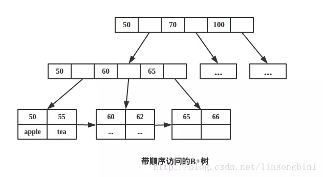

# B+树

概述：b+树是b树的一种，但有很多不同的地方

图示：

与b-tree对比：

  1. 每个节点不再只是存储一个key了，可以存储多个key；
  2. 非叶子节点**只存储key**，叶子节点存储key和数据。
  3. 叶子节点两两相连，为顺序查询提供了帮助

相比b-tree优点：

  1. B+树的非叶子节点只是存储key，占用空间非常小，因此每一层的节点能索引到的数据范围更加的广。换句话说，每次IO操作可以观看更多的数据
  2. 叶子节点两两相连，符合磁盘的预读特性。如图三中存储50和55的叶子节点，它有个指针指向了60和62这个叶子节点，那么当我们从磁盘读取50和55对应的数据的时候，由于磁盘的预读特性，会顺便把60和62对应的数据读取出来。这个时候属于顺序读取，而不是磁盘寻道了，加快了速度。
  3. 支持范围查询，而且部分范围查询非常高效，原因是数据都是存储在叶子节点这一层，并且有指针指向其他叶子节点，这样范围查询只需要遍历叶子节点这一层，无需整棵树遍历。