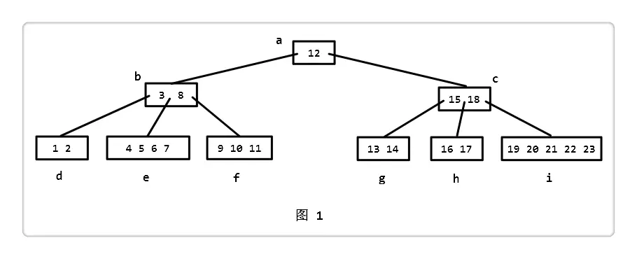
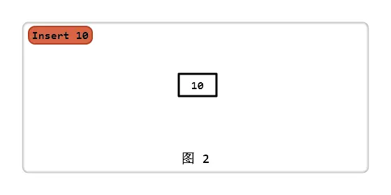
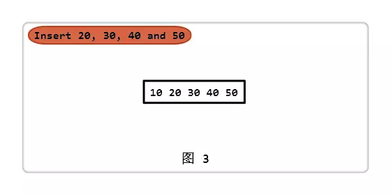
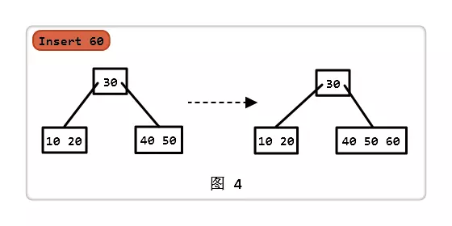
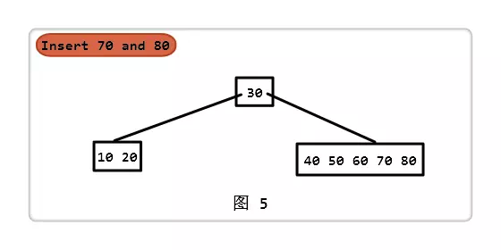
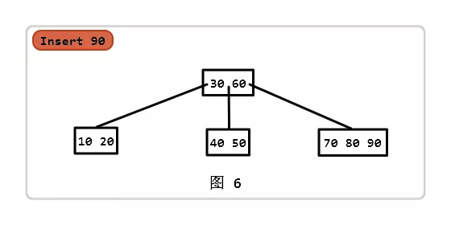
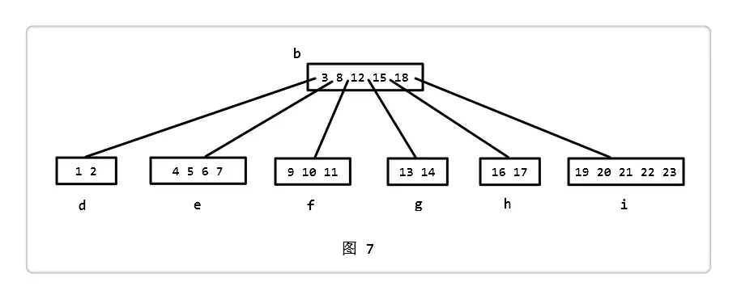
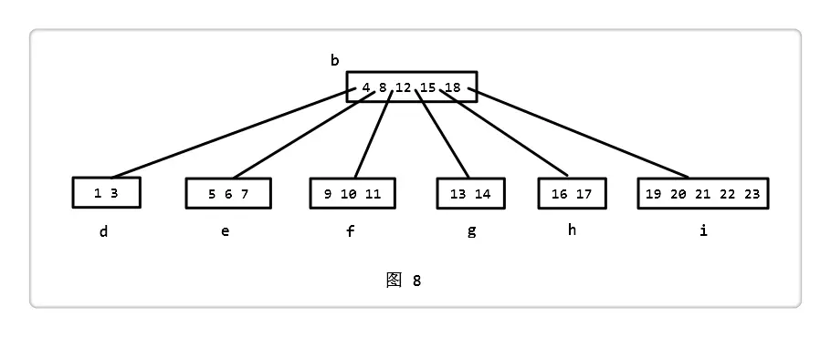

# B-树

概述：叫做B树，而不是B减树，有人这样叫是因为把'-'读成'减'，简单来说是t叉搜索树，和bs-tree相似，不过每个结点有多个值，还有多个儿子。

性质：
  1. 所有的叶子结点在同一层；
  2. 每棵 B - 树有一个 Minimum Degree，称其为 t（t 的值取决于磁盘块的大小）；
  3. 除了根结点，其余每个结点至少包含 t-1 个 keys，根结点可以只包含 1 个 key；
  4. 每个结点（包括根结点）最多包含 2t-1 个 keys；
  5. 一个结点的孩子指针数等于这个结点的 keys 数 + 1；
  6. 每个结点的 keys 都按升序排列；
  7. 对于每个 key，其左边孩子结点的所有 keys 都小于它，右边孩子结点的所有 keys 都大于它。

图示：

## 插入操作(示例中 Minimum Degree = 3):

1. 插入10: 对于一棵空树，直接插入即可

2. 插入20,30,40,50: 此时根结点 keys 数正好达到上限 5(由 2t - 1 = 6 - 1 = 5 得)

3. 插入60: 插入根结点的话 keys 会超过上限，那么我们的做法就是先把它一分为二，之后在插入60

4. 插入70,80: 此时根结点最右边孩子结点的 keys 数已达到上限

5. 插入90: 按照之前一分为二的思想，把中间的 key，即 60 移到上面，最后插入 90

## 删除操作:

分为多种情况(删除的 key 在结点 t 中)

注："前驱"指离该 key 最近且比该 key 小的 key，"后继"指离该 key 最近且比该 key 大的 key

  - t 是叶子结点。
    - 这种情况很简单，直接删除即可。

  - t 不是叶子结点。分三种情况，我们约定 key 的左边的孩子结点为 left，右边的孩子结点为 right，
    - left 的 keys 数大于 t-1，那就在 left 中找到 key 的 "前驱"，用 "前驱" 替换 key，转而继续删除 "前驱"；
    - right 的 keys 数大于 t-1，那就在 right 中找到 key 的 "后继"，用 "后继" 替换 key，转而继续删除 "后继"；
    - left 和 right 的 keys 数都等于 t-1，那就把 left，key 和 right 合并为一个结点，继续在这个结点中删除 key。

  - t 是叶子结点（不是根结点），且 keys 数恰好等于 t-1

    

    - 图1中，删除2: 从根节点 a 开始，要下降的结点为 b，发现 b 的 keys 数为 t-1，而它的右兄弟结点 c 的 keys 数也只有 t-1，进行合并。合并后如下图 7

    

    - 接着在结点 b 中找，要下降的结点为 d，发现 d 的 keys 为 t-1，而它的右兄弟 e 的 keys 是大于 t-1 的，那我们就从 e 里拿一个 key：把 3 放进 d 中，4 放进 b 中。此时 b 结点 keys 数不变，d 变成 3 个，e 少了一个，但依旧满足大于等于 t-1。删除 2 后，如下图 8

    

    - 如果要下降的那个结点的 keys 数等于 t-1，我们就对其进行填充（或从兄弟里拿一个，或直接合并），使其 keys 数大于 t-1。这样的做法很有用处，且也必须这么做。

    >为什么 "必须" 呢？
    >
    >请看图 1，假设我们不在下降的过程中进行填充操作了，现在如果要删除结点 g 中的 13，问题出现了，g 的 keys 数就会小于 t-1，此时违反 B - 树的性质 3。那怎么解决这个问题呢？从兄弟结点 h 中拿一个？不可以，h 的 keys 数也是 t-1。合并？所谓的合并就是把 g，15 和 h 合并为一个结点，可是 c 的 keys 数也是 t-1，也行不通。因此，对要下降的那个 keys 数等于 t-1 的结点进行填充是必要的。
    >
    >那又如何 "很有用处" 了呢？
    >
    >观察 "删除 2" 后，图 1 到图 8 的变化，整棵 B - 树的高度降低，高度降低意味着查找效率的提高。分析发现，它之所以会降低，是因为进行了合并操作。读者可以再仔细分析下会发现，这是降低 B - 树高度的唯一方式：根结点一个 key，左右两个孩子结点的 keys 数都是 t-1，合并成一个具有 2t-1 个 keys 的结点。