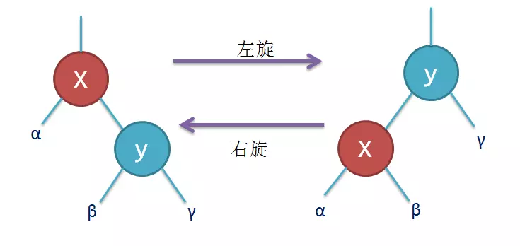

# 二叉搜索树 (bs-tree)

概述：一颗二叉树，每个节点都比他的左儿子大，比他的右儿子小(或者相反)，称为二叉搜索树

优点：查找一个值时，遍历时每次只需要比较目标与结点的大小选择左还是右，理想状态下，查询的时间复杂度为O(log2(n))

缺点：当插入的元素递增或者递减时，会出现树严重偏向于一边，导致时间复杂度回到O(n)

# 二叉搜索树的旋转操作

如图所示，旋转之后不会违反二叉搜索树的大小顺序，可用于调整二叉树左右子树的高度，下面的 avl-tree 和 rb-tree 都会用到

# 平衡二叉树 (avl-tree)

概述：相比二叉树，任意结点的孩子结点之间高度差距最大为1，这个1又叫做平衡因子，

操作：当插入和删除结点导致不平衡，即左右子树高度相差2或者以上，就要使用旋转操作进行平衡。

优点：保证左右子树平均分布，把查询的时间复杂度维持在O(log2(n))

# 红黑树 (rb-tree)

概述：类似于avl-tree，也是为了平衡高度的二叉搜索树，他包含5条规则。

规则：
  1. 每个节点要么是黑的，要么是红的
  2. 根节点是黑的
  3. 叶节点是黑的
  4. 如果一个节点是红的，他的两个儿子节点都是黑的
  5. 对于任一节点而言，其到叶节点树尾端NIL指针的每一条路径都包含相同数目的黑节点

操作：插入根结点为黑色，插入其他结点一开始规定为红色，当插入和删除结点导致不符合以上规则时，通过转换结点的颜色和旋转操作进行平衡，具体怎么转换这里不详细讲。

优点：保证左右子树平均分布，把查询的时间复杂度维持在O(log2(n))