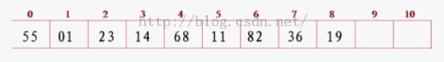
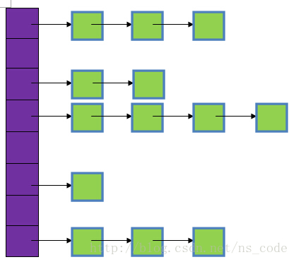
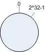
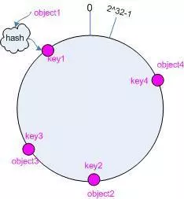
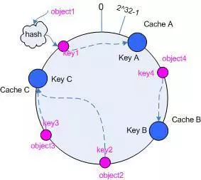
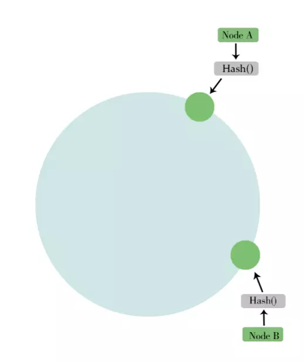

# 一致性 hash 算法

## 1. hash 算法



将一个值通过一种计算hash(value)使其变成另一个数，这个数称为 hashcode，查找 hash 中的值时，只需要知道他的 hashcode 找到对应地址就能查出来，这种查找最快的时间复杂度为O(1)。

## 2. hash 冲突解决方法

上面的 hash 算法有一个问题，如果两个值都算到同一个 hashcode 的话会产生冲突，下面我们介绍一下解决冲突的方式

- 开放定址法

  当关键字key的哈希地址 p=H（key）出现冲突时，以p为基础，产生另一个哈希地址p1，如果p1仍然冲突，再以p为基础，产生另一个哈希地址p2，…，直到找出一个不冲突的哈希地址pi ，将相应元素存入其中。

  一般有三种子方式：

  1. 线性探测再散列：每次冲突之后就找下一个槽，看是否为空，若为空，插入到该槽，否则，继续找下一个

  > h(i) -> h(i+1) -> h(i+2) -> ..... -> h(i+n) 插入成功

  2. 二次(平方)探测再散列：和线性探测类似，不过计算方法不同

  > h(i) -> h(i+1^2) -> h(i-1^2) -> h(i+2^2) -> h(i-2^2) -> ..... -> h(i+n^2)/h(i-n^2) 插入成功

  3. 伪随机探测再散列：先产生一个伪随机数的序列(如 list = {2,5,8,......})，这个序列是可以无限长的，由一种计算方式生成，接下来就是和线性探测一样了

  > h(i) -> h(i+2) -> h(i+5) -> h(i+8) -> ..... -> h(i+list[n]) 插入成功

- 再哈希法

  这种方法是先建立一个 hash 算法数组，hashlist = {h1(),h2(),h3(),......}

  当遇到冲突时，使用下一种方法 hash 即可。

  > h1(i) ->  h2(i) -> h3(i) -> ..... -> hn(i) 插入成功

- 链地址法

  同一个 hashcode 的值保存到同一个链表中，如图所示

  

- 建立公共溢出区

  将哈希表分为基本表和溢出表两部分，凡是和基本表发生冲突的元素，一律填入溢出表。

## 3. 一致性 hash 算法

背景: hash 一般可以用在分布式系统中进行负载均衡，例如，有三台服务器结点，每次我们上传数据，使用 n mod 3 这个公式计算 值为 n 的数据分发到哪个结点上，但是当我们新加入一台服务器结点时，原来的三台服务器都要重新计算，因为都变成 n mod 4 了，删除结点同理，当结点数量很多的时候，这种 rehash 即重新计算所有 hash 地址需要耗费很长的时间。

- 原理:

  1. 环形 hash 空间，如想象成 0-2^32-1，并且 2^32-1 之后回到 0 这个循环

  

  2. 把数据映射到 hash 空间，即使用 hash 算法计算到数据对应的范围在 0-2^32-1 的 hashcode 值

  

  3. 把服务器(节点)映射到 hash 空间，例如把三台服务器的 hash 值设为 10,100,1000

  

  4. 这样每个数据都有了对应的结点:

    ```
    0 分到 10 的结点
    11 分到 100 的结点
    155 分到 1000 的结点
    999 分到 1000 的结点
    10000 分到 10 的结点，因为是一个循环
    ```

  5. 增加一个新的结点时，先分配一个新的 hash 值给它，如新节点的 hash 值为 500，那么只需要把 hash 值在 100-500 范围之内的数据从 1000 的结点转移到 500 的结点即可。

  6. 删除一个已有结点时，如删除 1000 这个结点，只需要把 hash 值在 100-1000 范围之内的数据转移到 10 这个结点即可

- 虚拟结点:

  当结点数量少时，并且结点之间距离很近的时候会出现大部分数据都存放在一个结点的不均衡情况，如下图，NodeA 占有大部分 hash 值的数据

  

  为了解决这种数据倾斜问题，一致性哈希算法引入了虚拟节点机制，即对每一个服务节点计算多个哈希，每个计算结果位置都放置一个此服务节点，称为虚拟节点。

  

  这样 A 和 B 就分布的比较均匀了。