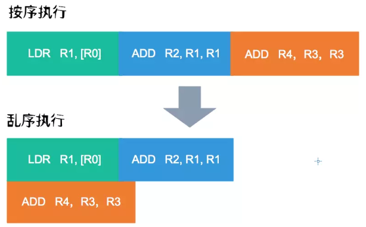

## CPU 指令乱序

随着处理器流水线技术和多核技术的发展,目前的高级处理器通过提高内部逻辑元件的利用率来提高运行速度,通常会采用乱序执行技术。这里的内部原件可以分成很多种情况，大的可以分为多核之间的并行，小的可以是单核中不同的运算器和控制器，而乱序的目的就是为了把顺序执行的指令分给不同原件达到并行执行的效果来提升效率

---

例子分析:

```
LDR   R1, [R0];
ADD   R2, R1, R1;
ADD   R4, R3, R3;
```

- 如上面三条汇编指令，如果不乱序，由于第二条指令需要第一条指令完成后才能执行，而第三条指令和第二条指令用同一个运算器，因此只能顺序执行，我们就需要3个时钟周期完成这三条指令。
- 但是第一条指令和第三条指令是完全无关的，那么乱序就是要把指令顺序改成如下

    ```
    LDR   R1, [R0];
    ADD   R4, R3, R3;
    ADD   R2, R1, R1;
    ```

- 这样的话第一条和第二条指令可以同时在控制器和运算器执行，节省了等待第一条指令执行的时间
- 看图更容易理解

    

---

### CPU 缓存导致的指令重排

在多核环境下，多个 cpu 都有着自己的 cache (L1,L2)，当一个 cpu_1 向内存变量写值且其他 cpu_2 保存着该变量的 cache 时，写值需要发消息告诉 cpu_2 它们的 cache 已经无效，之后等待 cpu_2 返回才写值，但是出于效率考虑，不可能一直阻塞在这个位置，因此会把这条指令存放到 cpu_1.store buffer 中，直到收到 cpu_2 的返回确认才执行这条指令，而在这个 cpu_1 等待返回的期间就可以执行接下来的指令，导致了 cpu_1 指令乱序。并且，cpu_2 接收到这个 cache 无效消息并返回确认之后，也不会立即处理，而是把这条 cache 无效的指令放到 cpu_2.invalidate queue 处理，如果 cpu_2 接下来在读取缓存之前还没有处理这个 cache 无效的指令就会读取到之前已经无效的 cache 数据，这造成了 cpu_2 的指令乱序。

---

### 编译器指令重排

这是编译器优化的一种方法，原理和处理器的乱序差不多，之所以出现编译器乱序优化其根本原因在于处理器每次只能分析一小块指令,但编译器却能在很大范围内进行代码分析,从而做出更优的策略,充分利用处理器的乱序执行功能。

---

### 指令乱序带来的问题

在使用多核的编程下，指令乱序会导致我们认为的顺序代码的执行效果和实际的执行效果产生偏差，例如以下两段代码在两条线程下（不同 cpu）运行

```
# thread 1
a = 1;
b = 2;

# thread 2
while (b != 1);
assert (a == 1);
```

从我们看代码的理解上看，如果 thread 1 执行了 b = 1，那么 a = 2 肯定成立，实际上有各种可能出现指令乱序使 b = 2 在 a = 1 先执行导致 assert 返回 false

---

### 内存屏障 (memory barrier)

由于指令重排带来的问题，我们需要设置一个机制来限制一下，这就是内存屏障

| 类型        | 指令    |  作用  |
| --------   | :-----   | :---- |
| LoadLoad Barriers | Load1;LoadLoad;Load2 | 该屏障确保 Load1 数据的装载先于 Load2 及其后所有装载指令的的操作 |
| StoreStore Barriers | Store1;StoreStore;Store2 | 该屏障确保 Store1 立刻刷新数据到内存(使其对其他处理器可见)的操作先于 Store2 及其后所有存储指令的操作 |
| LoadStore Barriers | Load1;LoadStore;Store2 | 确保 Load1 的数据装载先于 Store2 及其后所有的存储指令刷新数据到内存的操作 |
| StoreLoad Barriers | Store1;StoreLoad;Load2 | 该屏障确保 Store1 立刻刷新数据到内存的操作先于 Load2 及其后所有装载装载指令的操作.它会使该屏障之前的所有内存访问指令(存储指令和访问指令)完成之后,才执行该屏障之后的内存访问指令 |

在 cpu cache 中的体现: 在 store 时都存到 store buffer 按顺序执行，在 load 时 先把 invalidate queue 所有指令处理，刷新 cache

---

### 注意：

1. 这里所有的重排都不能对有依赖的两个指令重排，例如

    ```
    a = 1
    b = a + 1
    ```

2. 在高级语言中，一条指令不一定是一个原子操作，因为在底层并不止一条指令，因此高级语言中的两个指令可能会被拆开同时运行

    **`b = a + 1` -> `load x a`; `add x 1`; `store b x`**