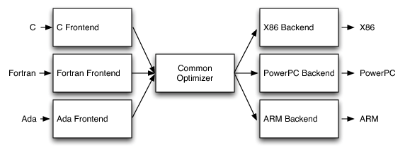

## Low Level Virtual Machine

- 传统的编译器结构分成前端，优化器，后端

    

    - 前端负责从代码经过词法分析，语法分析建立抽象语法树(Abstract Syntax Tree)，再将其转换成一种中间码，以 java 为例，中间码就是字节码

    - 优化器对中间码进行优化，提高代码运行效率

    - 后端将中间码转换成对应平台的代码，如 x86

- LLVM 的编译器结构

    

    - 前端负责从代码经过词法分析，语法分析建立抽象语法树(Abstract Syntax Tree)，再将其转换成 **IR**，典型的前端有 Clang

    - 优化器对 **IR** 进行优化，提高代码运行效率

    - 后端将 **IR** 转换成对应平台的代码，如 x86

    - 主要是在不同高级语言的前端和优化器之间使用了 LLVM IR 作为统一的中间码，优化器只需要对 IR 进行优化，而后端也只需要把 IR 翻译成不同平台的汇编和机器码，降低了语言和优化之间的耦合度

- LLVM 优化

    1. LLVM 使用 PASS 进行优化，每一个 PASS 做一种优化，不过也有 PASS 不做优化，只是分析代码，把结果传给另外一个 PASS，因此 PASS 是可重用的

    2. LLVM 不需要等待一个 PASS 工作完再执行另外一个 PASS，它是以流水线模式工作的，也就是上一个 PASS 执行完一段代码，或者返回一段代码的一些信息之后，另一个 PASS 就可以利用这一段代码的信息进行优化，而不需要整个项目代码都遍历一遍再去执行

    3. 通过这种模式，每个 PASS 的耦合度很低，我们可以自由选择优化的策略
