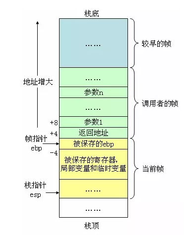

## 汇编，寄存器和栈帧

### 基本概念

- 寄存器：一个保存着固定位数的容器，在 cpu 控制器中，运算时，将需要的数据从内存读取到寄存器中，再用运算器计算寄存器中的数据。它们可用来暂存指令、数据和地址。在 cpu 的控制部件中，包含的寄存器有指令寄存器（IR）和程序计数器。

- ABI(application binary interface)：一个ABI定义了机器代码如何访问数据结构与运算程序，依赖于硬件（包括寄存器），高级语言需要按照这个ABI来设计。ABI平台有很多，例如 x86, arm64等等。ABI一般会订立以下规定
    1. 数据类型的大小、布局和对齐
    2. 调用约定（控制着函数的参数如何传送以及如何接受返回值），例如，是所有的参数都通过栈传递，还是部分参数通过寄存器传递；哪个寄存器用于哪个函数参数；通过栈传递的第一个函数参数是最先 push 到栈上还是最后
    3. 系统调用的编码和一个应用如何向操作系统进行系统调用
    4. 在一个完整的操作系统ABI中，目标文件的二进制格式、程序库等等

- 栈帧(stack frame)：在函数和过程调用时，我们需要使用栈，栈帧就是对应一个过程的对应符号，一个栈帧包含调用栈里面的一个连续地址

### 两者关系

1. 通常使用寄存器来记录栈帧的一些地址位置，如%ebp指向栈帧开始地址，%esp指向栈顶
2. 我们通过这些地址的偏移地址(offset)来操作一个函数的相关数据，如函数的参数，函数的局部变量，函数的返回值等等，而这些地址之间的关系由ABI决定
3. 一些平台还可以用更多的寄存器来代替堆栈地址来提升性能，如X86-64中，%rax 作为函数返回值使用，%rsp 栈指针寄存器，指向栈顶，%rdi，%rsi，%rdx，%rcx，%r8，%r9 用作函数参数，依次对应第1参数，第2参数。。。，%rbx，%rbp，%r12，%r13，%14，%15 用作数据存储

### 汇编调用函数和他们的关系

直接用一个例子来说明：

```
.main:
    push rbp
    mov rbp, rsp
    sub	rsp, 48
    mov	dword ptr [rbp - 8], ecx
    cmp	dword ptr [rbp - 8], 1
    jg .LBB0_2
# BB#1:                                 # %if.then
    mov	dword ptr [rbp - 4], 1
    jmp .LBB0_3
.LBB0_2:                                # %if.end
    mov	eax, dword ptr [rbp - 8]
    mov	ecx, dword ptr [rbp - 8]
    sub	ecx, 1
    mov	dword ptr [rbp - 12], eax # 4-byte Spill
    call .func
    mov	ecx, dword ptr [rbp - 12] # 4-byte Reload
    imul ecx, eax
    mov	dword ptr [rbp - 4], ecx
.LBB0_3:                                # %return
    mov	eax, dword ptr [rbp - 4]
    add	rsp, 48
    pop	rbp
    ret
```



1. push rbp: 保存调用者的栈帧地址
2. mov rbp, rsp: 将当前栈帧的栈底地址赋值到 rbp
3. sub rsp, 48: 定义下一个栈帧的顶点地址，48 表示当前栈帧可以用的空间，也可以用作栈顶，因为48之后就是下一个栈帧了，为上面的说明2提供准备
4. 之后使用 [rbp - 4] 这种栈底地址偏移的方法获取函数的变量，如参数，局部变量
5. ABI约定的体现:
    - eax 保存返回值，因此 ret 之后，调用者要从 eax 获取返回值
    - ecx 保存着第一个参数，`mov dword ptr [rbp - 8], ecx` 将参数放到栈顶8个字节的位置中
    - 这里 ecx 是32位(4 byte)寄存器，因此 [rbp - 4] 可以存一个值，rbp - 4 是起始地址，因此 [rbp - 8] 可以存一个值，rbp - 8 是起始地址
6. add rsp, 48：对应3，回收栈空间
7. pop rbp: rbp 恢复调用者的栈帧地址
8. call .func: 这一句话做了两件事
    - push rip 调用方法之前保存下一条指令的地址，用于返回时跳回来
    - jmp .func 跳到目标代码段
9. ret: 返回，相当于 pop rip 然后跳回到调用时的下一跳地址，对应 call
