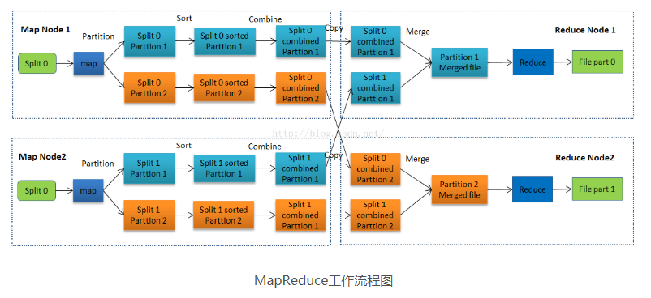

## Hadoop Map Reduce 流程

- 步骤总览: split、mapper、shuffle、reduce


- 下面的代码示例都是 java 编写

1. split(输入分片): \
从文件系统(本地或者 hdfs 等)以分片为单位输入数据，输入分片存储的并非数据本身，而是一个分片长度和一个记录数据的位置的数组，输入分片往往和 hdfs 的 block（块）关系很密切，假如我们设定 hdfs 的块的大小是 64mb，如果我们输入有三个文件，大小分别是 3mb、65mb 和 127mb，那么 mapreduce 会把 3mb 文件分为一个输入分片，65mb 则是两个输入分片，而 127mb 也是两个输入分片。

>说明：这里可以优化的是每个分片的大小，如果一些分片很大，一些分片很小会导致小的分片 map 结束后要等待大分片 map 结束才能进行 reduce。

2. map: \
就是调用开发者写的 map 函数，其中 map 方法参数是 split 中的分片数据，如以下代码:
```
public class WordMapper extends Mapper<Object, Text, Text, IntWritable>{

	@Override
	protected void map(Object key, Text value, Mapper<Object, Text, Text, IntWritable>.Context context)
			throws IOException, InterruptedException {
		String line = value.toString();
		String[] words = line.split(" ");
		for(String word:words) {
			context.write(new Text(word), new IntWritable(1));
		}
	}
}
```
>说明：需要继承 Mapper 接口，4个泛型分别指：输入key类型，输入value类型，输出key类型，输出value类型

3. shuffle: \
将 map 的输出作为 reduce 的输入的过程就是 shuffle 了，它也有几个阶段，分别是partition，sort，combine，group，最后写入磁盘。

- partition: 根据开发者写的 partition 返回的数将 map 输出的 key-value 数据分区，不同的分区分配到不同的 reducer 进行处理。下面是 partition 代码示例:
```
public class YearPartition extends Partitioner<KeyPair, Text> {

  @Override
  public int getPartition(KeyPair key, Text text, int num) {
    //按年份分区，乘以127为了使数据分散
    return (key.getYear() * 127) % num;
  }
}
```
>说明：\
>1.需要继承 Partitioner 接口，3个泛型指：map输出的key类型，map输出的value类型，reducer的数量。\
>2.让数据尽可能分散到不同的 reducer 可以优化性能。

- 写入缓冲区：map在做输出时候会在内存里开启一个环形内存缓冲区，这个缓冲区专门用来输出的，默认大小是100mb，并且在配置文件里为这个缓冲区设定了一个阀值，默认是0.8。分区之后的数据先存到这个缓冲区，如果缓存区被撑满了，那么map就会阻塞写入内存的操作，让写入磁盘操作完成后再继续执行写入内存操作。

- sort：在写入磁盘之前对缓冲区中数据以 key 为基准进行排序。
>说明：\
>1.如果调用jobconf的setOutputKeyComparatorClass()设置mapred.output.key.comparator.class \
>2.否则，使用key已经登记的comparator \
>3.否则，实现接口WritableComparable的compareTo()函数来操作

- combine（可选）：这是一个开发者可选的阶段，在排序后，先将结果合并一次，相当于先对这一小部分数据先 reduce 一次，减少之后 reduce 的负担。

- 写入磁盘：如果缓冲区的内存达到了阀值的80%时候，经过前面的sort,combine阶段之后就会把内容写到磁盘上，这个过程叫spill，另外的20%内存可以继续写入要写进磁盘的数据，写入磁盘和写入内存操作是互不干扰的。

- group：用开发者指定的规则分组，同一组会分配到同一个 values 集合中，被同一个 reduce 方法处理。下面是代码实例:
```
public class YearGroup extends WritableComparator {

  public YearGroup() {
    super(KeyPair.class, true);
  }

  @SuppressWarnings("rawtypes")
  @Override
  public int compare(WritableComparable a, WritableComparable b) {
    KeyPair o1 = (KeyPair) a;
    KeyPair o2 = (KeyPair) b;
    return Integer.compare(o1.getYear(), o2.getYear());
  }
}
```
>说明：需要继承 WritableComparator 接口并实现 compare 方法，通过 compare 方法返回 0（相等）的 key 分到同一组。


4. reduce:
就是调用开发者写的 reduce 函数，拿到自己对应分区的 key-value 进行 reduce 操作。代码示例如下:
```
public class WordReducer extends Reducer<Text,IntWritable,Text,IntWritable>{
	@Override
	protected void reduce(Text key, Iterable<IntWritable> values,
			Reducer<Text, IntWritable, Text, IntWritable>.Context context) throws IOException, InterruptedException {
		int count = 0;
		for(IntWritable value:values) {
			count += value.get();
		}
		context.write(key, new IntWritable(count));
	}
}
```
>说明：\
>1.需要继承 Reducer 接口，4个泛型分别指：map输入key类型，map输入value类型，输出key类型，输出value类型。\
>2.reduce 方法的第二个参数 values 就是同一个分组的所有 value 。