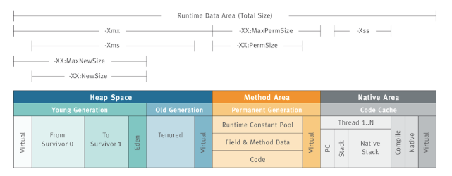

## jvm gc (垃圾回收机制)

- 这里主要讲分代回收机制

1. 内存结构
  - 年轻代：一个 Eden 区和两个 Survivor 区
  - 年老代：一个 Tenured 区
  - 持久代：一个 Permanent 区

2. 新建立的对象先放到 Eden 区中，如果 Eden 区满了之后，就会执行标记-清除算法回收 Eden 区垃圾，并把生存的对象放到 Survivor 的其中一个区中，两个 Survivor 区有一个必须是空的，当其中一个 Survivor 满了之后，采用标记-复制方法，把生存的对象放到另外一个 Survivor 区。

3. 在年轻代中经历了N次垃圾回收后仍然存活的对象，就会被放到年老代中。

4. 持久代用于存放静态文件、Java类、方法、静态对象等。

- 触发 gc 的条件

1. Scavenge GC: 当新对象生成，并且在Eden申请空间失败时，就会触发Scavenge GC，对Eden区域进行GC，清除非存活对象，并且把尚且存活的对象移动到Survivor区。然后整理Survivor的两个区

2. Full GC: 对整个堆进行整理，包括Young、Tenured和Perm。Full GC因为需要对整个对进行回收，以下原因可能导致 Full GC
  - 年老代（Tenured）被写满
  - 持久代（Perm）被写满
  - System.gc()被显示调用
  - 上一次GC之后Heap的各域分配策略动态变化