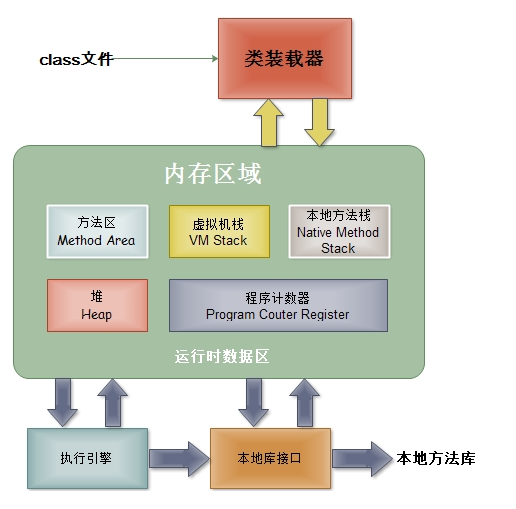

## jvm 参数说明

1. jvm 结构

- 方法区: 也是 jvm gc 中的持久代，它用于存储虚拟机加载的类信息、常量、静态变量、是各个线程共享的内存区域。

- 堆: 也是被各个线程共享的内存区域，在JVM启动时创建。该内存区域存放了对象实例及数组，包括 jvm gc 中的年轻代和年老代。

- 虚拟机栈: 每个方法被执行的时候 都会创建一个“栈帧”用于存储局部变量表(包括参数)、操作栈、方法出口等信息。每个方法被调用到执行完的过程，就对应着一个栈帧在虚拟机栈中从入栈到出栈的过程。声明周期与线程相同，是线程私有的。而局部变量表中继承 Object 的对象都是引用堆和方法区的内存，而基本数据类型的对象(boolean、byte、char、short、int、float、long、double)则是直接保存存在栈中。

- 本地方法栈: 与虚拟机栈基本类似，区别在于虚拟机栈为虚拟机执行的java方法服务，而本地方法栈则是为Native方法服务。

- 程序计数器: 类似于PC寄存器，是一块较小的内存区域，通过程序计数器中的值寻找要执行的指令的字节码，由于多线程间切换时要恢复每一个线程的当前执行位置，所以每个线程都有自己的程序计算器。

2. 各参数说明

- -Xmx: 堆内存大小的上限

- -Xms: 堆内存大小的初始值

- -Xmn: 年轻代内存大小,年轻代包括两个区，Eden 和 Survivor 区，Suvrvior 区还被平均分成了两块 from space 和 to space

- -Xss: 每条线程内存大小

- -XX:PermSize(java8 之后变成了 -XX:MetaspaceSize): 持久代初始内存大小

- -XX:MaxPermSize(java8 之后变成了 -XX:MaxMetaspaceSize): 最大持久代内存大小

- -XX:NewSize: 新生代初始堆内存占用的默认值

- -XX:MaxNewSize: 新生代占整个堆内存的最大值

- -XX:NewRatio: 老年代对比新生代的空间大小, 比如2代表老年代空间是新生代的两倍大小

- -XX:SurvivorRatio: Eden/Survivor的值，比如8表示Survivor:Eden=1:8, 因为survivor区有2个, 所以Eden的占比为8/10

- -XX:CompressedClassSpaceSize: 类指针压缩空间大小

3. 指针压缩介绍

- 64位平台上默认打开
- 使用-XX:+UseCompressedOops压缩对象指针 \
    "oops"指的是普通对象指针("ordinary" object pointers) \
    Java堆中对象指针会被压缩成32位 \
    使用堆基地址（如果堆在低26G内存中的话，基地址为0）
- 使用-XX:+UseCompressedClassPointers选项来压缩类指针 \
    对象中指向类元数据的指针会被压缩成32位 \
    类指针压缩空间会有一个基地址

4. 元空间和类指针压缩空间的区别

- 类指针压缩空间只包含类的元数据，比如InstanceKlass, ArrayKlass \
    仅当打开了UseCompressedClassPointers选项才生效 \
    为了提高性能，Java中的虚方法表也存放到这里

- 元空间包含类的其它比较大的元数据，比如方法，字节码，常量池等