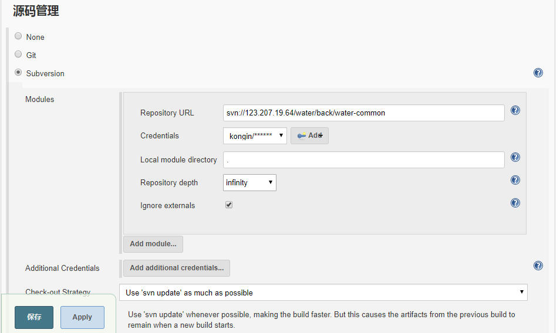
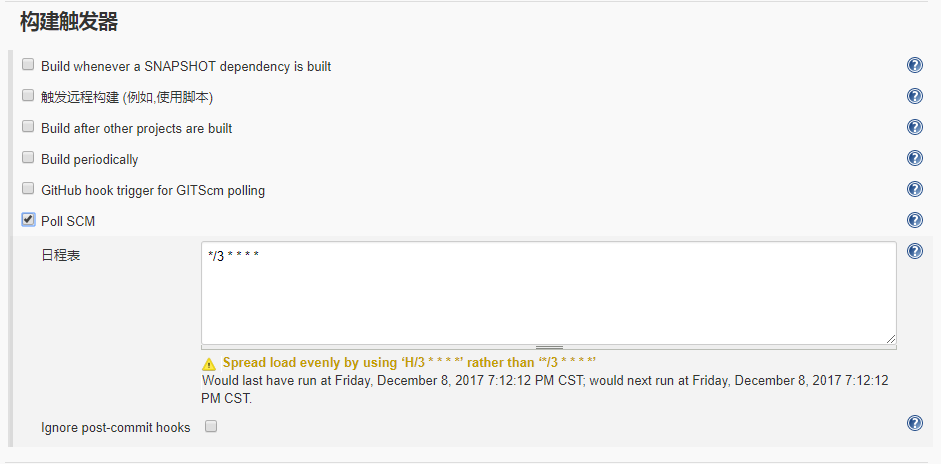
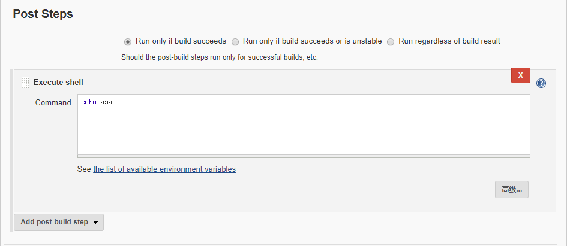
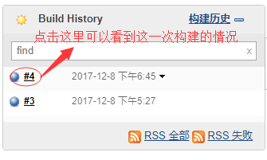

## jenkins 自动化构建 maven 项目

- 安装并初始化 jenkins (详见"/jenkins/jenkins 初始化.md")

- 在服务器上安装和配置 maven

- 下面全部在jenkins网页上操作

	- 配置jenkins的maven环境
		- "系统管理" -> "Global Tool Configuration"
		- "Maven Configuration" -> "Default settings provider"：你服务器上maven使用的"settings.xml"目录
		- "Maven" -> "新增Maven"，**不**勾选"自动安装"，"MAVEN_HOME"：你服务器上maven根目录

	- 新建一个任务，选择"构建一个maven项目"，"ok"（填名字最好不要用空格，否则linux建立的文件夹名称会很奇怪）
		- 如果没有这一项选择，"系统管理"　-> "管理插件" -> "可选插件" -> 勾选"Maven Integration plugin" -> "直接安装"

	- 源码管理（这里以svn为例）
		- Repository URL：仓库中项目的目录（特定到项目目录，不一定是仓库根目录）
		- Credentials："add" 添加一个 "username and password" 的，填上你svn的用户密码
		- Local module directory："pom.xml"的位置，必须使用相对路径，相对于Repository URL（默认是项目根目录"."）
		

	- 构建触发器
		- 我这里只勾选"Poll SCM"
		- schedule(日程表) 填入定时任务crontab格式的时间，代表定时检测svn有没有新的提交，如果有就自动构建
		

	- Build
		- Root POM：pom.xml文件名
		- Goals and options：maven执行的命令（不包含开头的"mvn"）
		- "高级" -> "Settings file"：maven配置 settings.xml的文件目录

	- Post Steps
		- 选择 "Run only if build succeeds"
		- "Add post-built step" -> "Execute shell"
		

	- 保存

- 运行原理：

	- 每次都从 svn/git 更新项目代码文件夹到 jenkins_home/workspace/
		jenkins_home: jenkins 放置文件的地方，默认是"~/.jenkins"

	- 在这个目录中执行基于 "pom.xml" 的 mvn 命令来构建项目

- 检查执行情况

	- 首页点击自己的 job (任务)

	- Subversion Polling Log：检测svn有没有新提交的日志

	- 工作空间/工作区：查看 "jenkins_home/workspace/" 中的本项目文件夹内容

	- Build History：构建历史
		
		- 进去之后可以通过"Console Output"查看构建日志