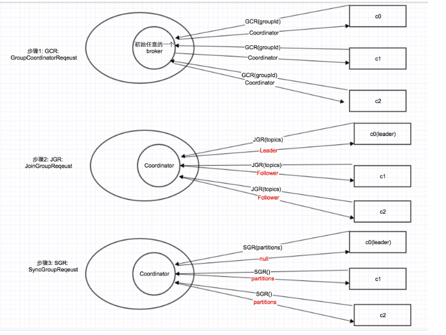

## kafka 消费者特征

1. 一个 partition 只能被同组的一个 consumer 消费的实现

  - 在0.9以前的client api中，consumer是要依赖Zookeeper的。因为同一个consumer group中的所有consumer需要进行协同，0.9之后新的consumer不依赖与Zookeeper，一个consumerGroup内的consumer由Coordinator管理

  - Coordinator 协议分为三个步骤：
    - 对于每1个consumer group，Kafka集群为其从broker集群中选择一个broker作为其coordinator。因此，第1步就是找到这个coordinator。（1个consumer group对应一个coordinator），由ConsumerNetworkClient发送请求去寻找coordinator。
    - 找到coordinator之后，向其发送JoinGroup请求，consumer在这里会被划分leader、follower
    - 由上面分配到的leader consumer进行partition分配，然后利用SyncGroup方法发送分配结果到coordinator，follower consumer也发送SyncGroup消息，获得这个分配结果



2. consumer fetch 步骤

  - 获取consumer的offset: 向Coordinator发了一个OffsetFetchRequest，并且是同步调用，直到获取到初始的offset，再开始接下来的poll.（也就是说Offset的信息如果存在Kafka里，是存在GroupCoordinator里面）

  - 如果kafka中也不存在offset，原因有可能是第一次fetch或者kafka故障丢失数据，那样就会根据
  
  - 生成FetchRequest，并放入发送队列: 针对每一个订阅的 topic 及其包含的每一个 partition 生成一个FetchRequest，即 `Map<Node, FetchRequest>`

  - 获取结果: 获取Broker返回的Response，里面包含了`List<ConsumerRecord> records`

3. offset 确认机制
  
  - 理解: 第二次poll调用的时候，提交上一次poll的offset和心跳发送

  - 自动提交 offset: 设置`auto.commit.enable=true`，会根据配置`auto.commit.interval.ms`定时发送offset，其实实际上是每次 consumer 会在另一个线程进行消费，消费结束后会把消息放到一个 offsetMap 中，当循环 poll 时，会执行一个 `maybeAutoCommitOffsetsAsync` 方法检测当前时间和上一次 commit 的时间差是否超过了配置的时间，如果超过了就执行 `doAutoCommitOffsetsAsync` 提交 offsetMap 中所有消费完的 offset

  - 以下代码可能会出现问题: 假如`do process message`操作耗时过长，那么这个consumer就无法发送心跳给coordinator，导致它错误认为这个consumer失去联系了，引起不必要的rebalance。槽糕的情况下，会丢重复消费数据，因此offset确认不应该被阻塞
  ```
  while(true) {
    consumer.poll();
    do process message
  }
  ```

4. consumer 预抓取

  - 由于对于一个TCP连接，broker 的请求处理链条中只会有一个正在处理的 (in-flight) 消息，因此 consumer 一般在提交上一次 offset 之后在进行下一次的 fetch，但是如果可以比较准确判断 fetch 响应包含消息的数目，比而提前发出 fetch request，可以提高 consumer 的性能．