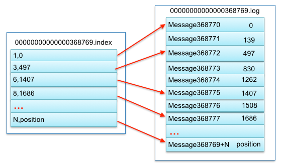
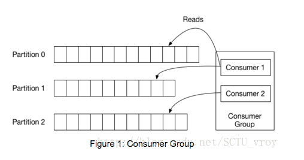

## kafka 中主要结构

1. producer: 生产者
  - 负责上传消息到 kafka

2. broker: 代理
  - 处理从 producer 收到的消息
  - 对于一个TCP连接，broker 的请求处理链条中只会有一个正在处理的 (in-flight) 消息
  - 一个 broker 负责多个 partition

3. topic: 主题
  - 区分消息种类
  - 每个 topic 的消息可以放到多个 partition，一个 partition 也可以放多个 topic 的消息
  - producer 发送这个 topic 的消息时，可以选择 partition key。

4. partition: 分区
  - 保存消息的队列
  - 每个 partition 有 offset 值，当 consumer commit 消息时，会将其 offset 移动到那条消息之后，下次就从那个 offset 之后获取消息
  - partition 可以有备份，一般分配到多个不同的 broker，因此备份数不能超过 broker 数
  - 多个 partition 不分顺序，如果要按顺序处理，需要 consumer 处理

5. logSegment: 消息段
  - 注意了，kafka 中的 log 其实是消息，而不是日志，配置里面的也是
  - 每个 partition 分为多个 segment，每个 segment 有自己的 log 文件放置消息，也有 index 文件防止索引，可以提高 offset 查询消息速度，比如消息偏移为368771，先通过二分查找找到segmentfile的0000000000000368769.index,然后计算在该文件的第几个位置n=368771-368769+=2,获取偏移139，然后去0000000000000368769.log取出偏移为139的msg368771，如下图

6. consumer group: 消费者组
  - 一个 consumer group 有多个 consumer
  - 一个 partition 只能被同组的一个 consumer 消费

7. consumer: 消费者
  - 从 kafka 以 poll 的方式 fetch 新的消息并处理
  - 通过 commit 表明自己已经接受并处理完消息（增加 partition offset）

-  从结构的角度的优化手段

1. partition 备份数与 broker 数相同或者比 broker 数量少一点，充分利用每一个 broker，但是也不要太大，否则每次备份需要时间过长

2. 每个 consumer group 中的 consumer 数量与 partition 相同，或者比 partition 多一点，不然会有 consumer 处于空闲状态，也可以尽量利用 partition