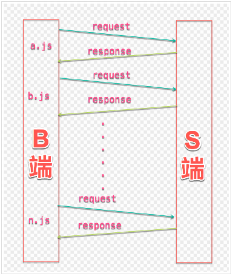
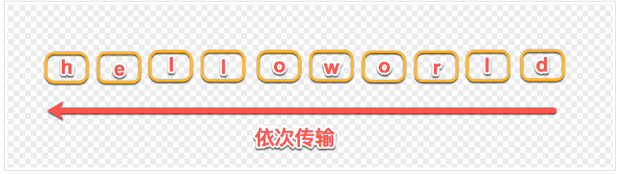

## HTTP2协议 (HTTP 2.0 版本)

1. Http 1.x 版本的问题

- 每次请求都会建立一次HTTP连接，也就是我们常说的3次握手4次挥手，如下图

- keepAlive: 一定时间内，同一域名多次请求数据，只建立一次HTTP请求，其他请求可复用每一次建立的连接通道，以达到提高请求效率的问题。

- keepAlive 问题: 
  1. 串行的文件传输。当请求a文件时，b文件只能等待，等待a连接到服务器、服务器处理文件、服务器返回文件，这三个步骤
  2. 由于每个浏览器保留着对同一个域名的连接，那个域名的服务端连接数过多，之后可能导致阻塞。例如假设Apache设置了最大并发数为300，因为浏览器限制，浏览器发起的最大请求数为6，也就是服务器能承载的最高并发为50，当第51个人访问时，就需要等待前面某个请求处理完成。

  

2. Http 2 版本可以解决上述问题

- 多路复用(Multiplexing): 
  1. 引入二进制数据帧和流的概念，其中帧对数据进行顺序标识，如下图所示，这样浏览器收到数据之后，就可以按照序列对数据进行合并，而不会出现合并后数据错乱的情况。同样是因为有了序列，服务器就可以并行的传输数据，这就是流所做的事情。

  

  2. 对同一域名下所有请求都是基于流，也就是说同一域名不管访问多少文件，也只建立一路连接。同样Apache的最大连接数为300，因为有了这个新特性，最大的并发就可以提升到300。