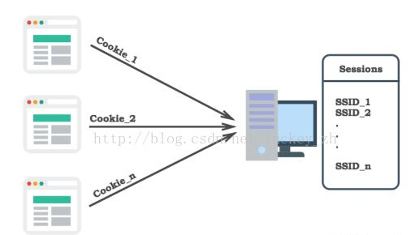
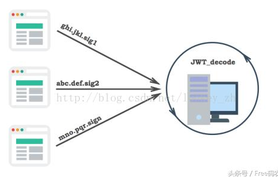

## Json Web Token

### 一、基本概念

- session + cookies



用户访问服务器之后，服务器会把用户会话信息保存在内存的 session 中，然后在 response 中添加一条让浏览器 set cookies 的 header，浏览器收到之后会添加一条 sessionId 的 cookies 到**内存中**(cookies 分为内存和磁盘的，存放在内存的在浏览器关闭之后就会消失，磁盘上的会一直存在到超时时间)。用户下次访问同一个域的服务器时，服务器就可以通过 sessionId 获取对应 session 的用户会话信息。

- jwt



与 session + cookies 方式不一样，jwt 是服务器无状态的，即服务器上不保存会话信息，主要把 jwt 返回给客户端，让客户端下次访问时带上，可以节省内存。

### 二、jwt 结构

1. header

  - 示例:
    ```
    {
      "typ": "JWT",
      "alg": "HS256"
    }
    ```
  - typ: 声明类型
  - alg: 声明加密的算法，通常直接使用 HMAC SHA256
  - 实际上 jwt 的第一部分是用 base64Url 对示例格式的 json 加密形成的字符串，即 base64UrlEncode(header)

2. payload

  - 示例:
    ```
    {
      "name":"Free码农",
      "age":"28",
      "org":"今日头条",
      "exp":13165416131654
    }
    ```

  - 标准中注册的声明 (建议但不强制使用):
    - iss: jwt签发者
    - sub: jwt所面向的用户
    - aud: 接收jwt的一方
    - exp: jwt的过期时间，这个过期时间必须要大于签发时间
    - nbf: 定义在什么时间之前，该jwt都是不可用的.
    - iat: jwt的签发时间
    - jti: jwt的唯一身份标识，主要用来作为一次性token,从而回避重放攻击。

  - 其他声明属于服务端业务逻辑需要的参数
  - 实际上 jwt 的第二部分是用 base64Url 对示例格式的 json 加密形成的字符串，即 base64UrlEncode(payload)

3. signature

  - 示例:
    ```
    HMACSHA256(
      base64UrlEncode(header) + "." +
      base64UrlEncode(payload),
      secret
    )
    ```
  - secret: 保存在服务器上的密钥
  - 可以这样理解，这个部分就是前面两个部分 (header + payload) 组合起来在加上一个密钥，用算法加密得到的
  - 这里的签名算法由 header 中的 "alg" 提供

4. 整合三部分的 jwt 格式: 
`base64UrlEncode(header).base64UrlEncode(payload).signature`

### 三、jwt 注意事项

1. 不要在 header 和 payload 中加入明文的敏感信息，因为这两个部分可以用 base64Url 解码，相当于明文传输。

2. 验证 signature 是为了防止 jwt 被恶意修改，由于 secret 是保存在服务器上的，因此难以被修改。

3. 将 jwt 放在 cookies 时最好设置 http-only=true，防止 javascript 可以直接拿到这个 jwt，进行 xss 攻击。

4. 服务器要对跨域访问进行限制，如限制只有自己前端网页的域才能访问接口，或者才能验证 cookies，防止 csrf 攻击。 