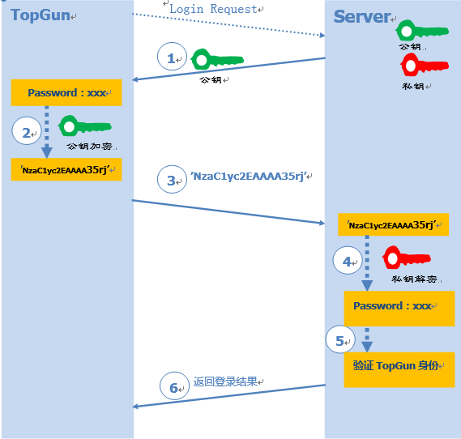
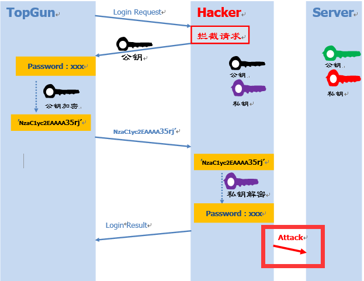
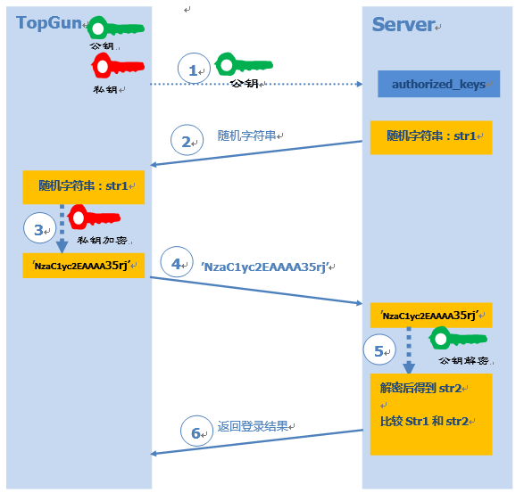

## SSH协议：

- 工作原理：

1. 基于口令的认证

	1.Client端用户TopGun发送登陆请求到Server端。\
	2.Server收到登录请求后，将公钥发送到Client端。\
	3.Client用返回的公钥对口令进行加密。\
	4.将加密后口令发送给Server。\
	5.Server用私钥对口令进行解密，对照用户名和口令是否正确。\
	6.根据比较结果，返回客户端登陆结果。
	
	

	风险：如果一个攻击者中途拦截Client的登录请求，向其发送自己的公钥，Client端用攻击者的公钥进行数据加密。攻击者接收到加密信息后再用自己的私钥进行解密，不就窃取了Client的登录信息了吗？这就是所谓的中间人攻击（如下图）

	

2. 基于公钥认证

	1.Client端用户TopGun将自己的公钥存放在Server上，追加在文件authorized_keys中。\
	2.Server收到登录请求后，随机生成一个字符串str1，并发送给Client。\
	3.Client用自己的私钥对字符串str1进行加密。\
	4.将加密后字符串发送给Server。\
	5.Server用之前存储的公钥进行解密，比较解密后的str2和str1。\
	6.根据比较结果，返回客户端登陆结果。

	