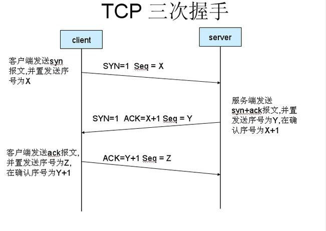
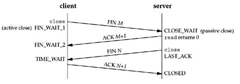

## TCP协议：

1. 三次握手：

- 注意：当客户端收到第二次握手包而不发送第三次握手，这会导致服务器重发第二次包，在此期间，服务器在内存里存放着客户端连接的信息直到连接超时，可以利用这一点，不断连接但是又不发送第三次握手来占满服务器内存，叫“洪水攻击”。

2. 四次挥手：

- 注意: 为什么断开TCP连接需要进行四次，而不是三次，虽然三次已经可以确认连接中断，但是TCP连接是全双工的网络协议，允许同时通信的双方同时进行数据的收发，同样也允许收发两个方向的连接被独立关闭，以避免client数据发送完毕，向server发送FIN关闭连接，而server还有发送到client的数据没有发送完毕的情况。

- 在TCP连接中，当被动关闭连接的一方(图中client)发送的FIN报文到达时，被动关闭连接的一方会发送ACK确认报文，并且进入TIME_WAIT状态，并且等待2MSL时间段(MSL:maximum segment life)。这么做有下述两个原因：

  1. 被动关闭连接的一方(图中的server)在一段时间内没有收到对方的ACK确认数据包，会重新发送FIN数据包，因而主动关闭连接的一方需要停留在等待状态以处理对方重新发送的FIN数据包。否则他会回应一个RST数据包给被动关闭连接的一方，使得对方莫名其妙。

  2. 在TIME_WAIT状态下，不允许应用程序在当前ip和端口上和之前通信的client(这个client的ip和端口号不变)建立一个新的连接。这样就能避免新的连接收到之前的ip和端口一致的连接残存在网络中的数据包。这也是TIME_WAIT状态的等待时间被设置为2MSL的原因，以确保网络上当前连接两个方向上尚未接收的TCP报文已经全部消失。

---

### Socket与三次握手过程的关系

1. 服务器新建一个 socket:serverSocket。
2. 服务器调用 bind 方法将 serverSocket 绑定一个端口。
3. 服务器调用 listen 方法监听 serverSocket 地址。
4. 客户端新建一个 socket:clientSocket。
5. 客户端调用 connect 方法来发送 syn 报文，参数包含本地 clientSocket 和目标服务器的 serverSocket 地址。
6. 服务器协议栈负责三次握手的交互过程。连接建立后，往 listen 队列中添加一个成功的连接，直到队列的最大长度。
7. 服务器调用 accept 方法从 listen 队列中取出一条成功的 tcp 连接，listen 队列中的连接个数就少一个。