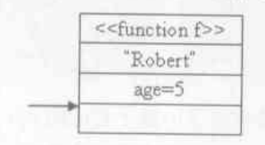
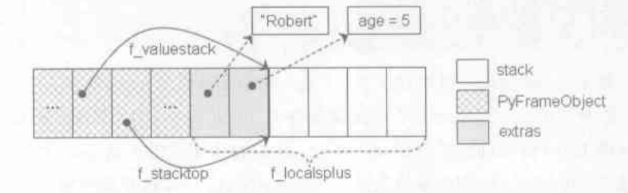
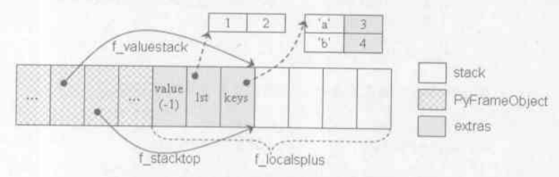
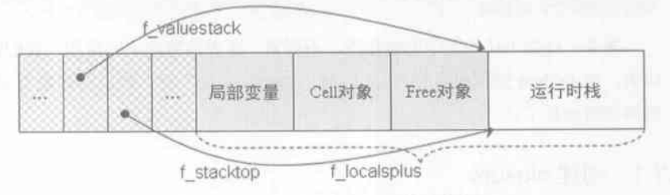
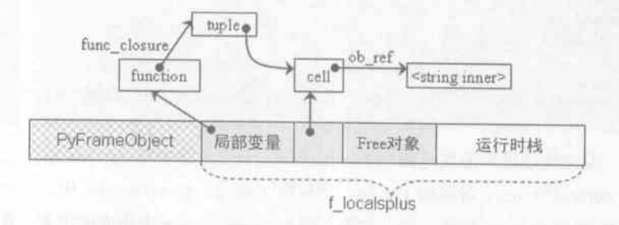
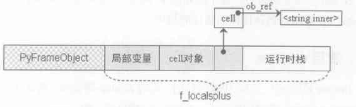

# python 函数机制

```
typedef struct {
    PyObject_HEAD
    PyObject *func_code; // PyCodeObject 对象
    PyObject *func_globals; // 函数运行时的 global 名字空间
    PyObject *func_defaults; // 默认参数
    PyObject *func_closure; // 用于闭包
    PyObject *func_doc; // 函数文档 PyStringObject
    PyObject *func_name; // __name__
    PyObject *func_dict; // __dict__
    PyObject *func_weakreflist;
    PyObject *func_module; // __module__
} PyFunctionObject;
```

PyCodeObject 是在编译时产生的，而 PyFunctionObject 则是运行时动态产生的，所以会出现多个 PyFunctionObject 引用同一个 PyCodeObject 的情况

## 参数类型

`def f(a, b, c=1, *args, **kwargs)

1. 位置参数: a, b
2. 键参数: c
3. 扩展位置参数: args
4. 扩展键参数: kwargs

## 函数定义

```
def g(a=1, b=2):
0 LOAD_CONST               1 (1)
3 LOAD_CONST               2 (2)
6 LOAD_CONST               3 (<code object g at 0000000003888E30, file "<stdin>", line 2>)
9 MAKE_FUNCTION            2
6 STORE_NAME               0 (g)
```

1. 上面是有参数默认值的情况，前两行代码会把参数默认值压入栈中，第三行把编译生成的 PyCodeObject 压入栈顶，MAKE_FUNCTION 创建一个 PyFunctionObject，将函数对应代码的 PyCodeObject 及其属性，以及名字空间的属性赋值到它身上，再根据 MAKE_FUNCTION 的参数 2 知道有两个默认参数，就会将栈上的两个参数弹出并设置到 PyFunctionObject 的 func_defaults 中，然后把这个 PyFunctionObject 压入栈顶，最后存入 f_locals 中
2. 如果是没有默认参数的情况，就没有前两条指令，然后 MAKE_FUNCTION 的参数为 0

## 函数调用

```
g(a, b=2)
9 LOAD_NAME                0 (g)
12 LOAD_GLOBAL              0 (a)
15 LOAD_CONST               2 ('b')
18 LOAD_CONST               3 (2)
21 CALL_FUNCTION          257
24 POP_TOP
```

1. 首先第一行字节码是将函数 g 这个 PyFunctionObject 压入栈顶
2. LOAD_GLOBAL 是将第一个位置参数压入栈顶，后面两条 LOAD_CONST 是将第二个键参数压入栈顶
3. 然后主要是要看这个 CALL_FUNCTION，它会获取栈顶指针，然后调用 call_function 方法

```
static PyObject* call_function(PyObject ***pp_stack, int oparg)
{
    int na = oparg & 0xff;
    int nk = (oparg >> 8) & 0xff;
    int n = na + 2 * nk;
    PyObject **pfunc = (*pp_stack) - n - 1;
    PyObject *func = *pfunc
    PyObject *x, *w;

    if (PyCFunction_Check(func) && nk == 0) {
        ...
    }
    else {
        if (PyMethod_Check(func) && PyMethod_GET_SELF(func) != NULL) {
            ...
        }
        if (PyFunction_Check(func))
            x = fast_function(func, pp_stack, n, na, nk);
        else
            x = do_call(func, pp_stack, na, nk);
        ...
    }
    ...
}
```

- na: 位置参数个数
- nk: 键参数个数
- n = na + 2 * nk, 因为键参数需要读键和值两个字节
- 从代码中可以看出 CALL_FUNCTION 后面的参数前八位代表位置参数个数 nk, 后八位代表键参数个数 na, 
- 上面的三个值是运行时调用函数时传入的参数决定

- co->co_argcount: 非扩展参数个数
- co->co_nlocals: 所有参数个数及其他局部变量个数之和，扩展参数只算一个变量，如 f(a, *args, **kwargs) 无论运行时传入多少参数，都只算三个变量 co_nlocals = 3 + x，因为 PyCodeObject 是编译时生成的

## 参数传递

- 快速通道

```
def f(name, age):
.....

    age += 5
    0 LOAD_FAST             1 (age)
    3 LOAD_CONST            1 (5)
    6 INPLACE_ADD
    7 STORE_FAST 1          (age)

f("Robert", age)
15 LOAD_NAME                0 (f)
18 LOAD_CONST               2 ('Robert')
21 LOAD_GLOBAL              0 (age)
24 CALL_FUNCTION            2
27 POP_TOP
28 LOAD_CONST               0 (None)
31 RETURN_VALUE
```



1. 我们知道跑完前三行字节码之后，运行栈中的情况如上图，箭头指向的是栈顶指针 pp_stack
2. CALL_FUNCTION 调用 call_function 算出各种参数的值，然后把 func 指针指向函数对象 PyFunctionObject, 这里有很多判断，得到这个 func 是一个 PyFunctionObject, 因此进入到 fast_function 中
3. fast_function 判断当前函数是否一般函数(没有默认参数，没有键参数，没有扩展参数等多个条件), 如果不为一般参数的话就会调用 PyEval_EvalCodeEx 函数，这个我们后面在讲，这里我们直接进入快速通道
4. 首先从当前线程中创建一个新栈帧 PyFrameObject f, 将函数 PyFunctionObject 中的 func_code 和 func_globals 对象传入到这个 PyFrameObject 中
5. 然后将调用函数时使用的位置参数一个一个的从栈上传入到 f->f_localsplus 上，具体操作是循环 f->f_localsplus\[i\] = *stack++, 这个 stack 指向第一步传入的栈上的参数，参数传入后的栈结构如下图
6. 最后调用 PyEval_EvalFrameEx 调用该栈帧即可以运行 func_code 的字节码了
7. 在 PyEval_EvalFrameEx 中调用 age += 5 的时候可以看到用的是 LOAD_FAST 和 STORE_FAST, 这两个指令和 LOAD_NAME 和 STORE_NAME 作用相似，只不过他们访问的是 f->f_localsplus, 如 LOAD_FAST 1 就是将 f->f_localsplus 上的 1 号位 age 压入运行时栈上，而 STORE_FAST 就是把 age 赋值为栈上的计算结果 10 了，这也就是函数引用参数的方法
8. 剩下的步骤参考虚拟机部分




- PyEval_EvalCodeEx(PyCodeObject *co, PyObject *globals, PyObject *locals, ....)

```
# 默认参数 [1]
def f(a=1,b=2):
    print a+b
f(b=3) # 键参数 [2]

# 扩展参数 [3]
def g(value, *lst, **keys):
    pass
g()
```

开头的步骤和上面的一致，我们直接来到 PyEval_EvalCodeEx 函数, 代码太长就不贴出来了，有兴趣的可以自行阅读源码或者看书，注意这个函数是针对 PyCodeObject 而不是 PyFunctionObject 的

1. 从当前线程中创建一个新栈帧 PyFrameObject f, 将参数 co 和 globals 和 locals (这里对应函数 PyFunctionObject 中的 func_code 和 func_globals 和 NULL) 对象传入到这个 PyFrameObject 中
2. 先将非扩展位置参数一个一个的从栈上传入到 f->f_localsplus 上
3. 如果有扩展位置参数，扩展位置参数的个数为 na(传入的位置参数个数) - co->co_argcount(PyCodeObject 中位置参数个数)，所以将后面多出来的扩展位置参数存入一个 tuple 中, 再将这个 tuple 对象放到 f->f_localsplus 对应的位置中
4. 遍历栈上的键参数，如代码 \[2\] 中只有 b=3，从 co->co_varnames 表中寻找函数的 def 语句中是否出现了对应的键，如果有的话，将其放到 f->f_localsplus 对应的位置中。这里需要讲解一下这个 co_varnames，在定义函数的时候，会把所有参数名记录在 co_varnames 中，并且它们的顺序与 def 语句中参数的顺序一致，还和 f->f_localsplus 存放参数的顺序一致，所以可以由这个 co_varnames 得出要把 b=3 放到 f_localsplus 的哪个位置
5. 如果第四步找不到对应的键，并且函数拥有扩展键参数，那么认为它是扩展键参数，将这种参数全部放到一个 dict 中，再将这个 dict 对象放到 f->f_localsplus 对应的位置中
6. 将 2, 4 步骤之后剩下的默认参数放到 f->f_localsplus 对应的位置，这个处理的时候确定默认值的参数总是在有默认值参数的后面，因此我们写 python 函数时默认值参数总是要写最后面
7. 最后调用 PyEval_EvalFrameEx

代码 \[3\] 使用扩展参数后的结构如下图


## 函数的局部变量

```
def f(a, b):
.....

    c = a + b
    0 LOAD_FAST                0 (a)
    3 LOAD_FAST                1 (b)
    6 BINARY_ADD
    7 STORE_FAST               2 (c)
    10 LOAD_CONST               0 (None)
    13 RETURN_VALUE
```
访问函数的局部变量时同样是使用 LOAD_FAST 和 STORE_FAST，也就是说函数的局部变量也是放在 f_localsplus 中的，而不是 f_locals，至于为什么没有使用 locals 名字空间，是因为函数中的局部变量总是固定的，因此在编译的时候就已经可以确定局部变量在内存中的位置，也就可以用静态的字节码去访问了，如 LOAD_FAST，否则如果需要动态查找 dict 对象的话，效率会慢很多

## 函数的闭包

```
typedef struct {
    PyObject_HEAD
    PyObject* ob_ref;
} PyCellObject;
```


虚拟机部分中得出 PyFrameObject 的 f_localsplus 的结构是局部变量 + cell变量 + free变量 + 运行时栈，如上图，其中 cellvar 和 freevar 是实现闭包的重要部分，上面的 PyCellObject 正是 cellvar 对象

```
def get_func():
0 LOAD_CONST               1 (<code object get_func at 0000000002587530, file "<stdin>", line 2>)
3 MAKE_FUNCTION            0
6 STORE_NAME               0 (get_func)

    value = "inner"
    0 LOAD_CONST           1 (inner)
    3 STORE_DEREF          0 (value)

    def inner_func()
    6 LOAD_CLOSURE         0 (value)
    9 BUILD_TUPLE          1
    12 LOAD_CONST           2 (<code object inner_func)
    15 MAKE_CLOSURE         0
    18 STORE_FAST           0 (inner_func)

        print value
        0 LOAD_DEREF             0 (value)
        3 PRINT_ITEM
        4 PRINT_NEWLINE
        5 LOAD_CONST             0 (none)
        8 RETURN_VALUE

    return inner_func
    24 LOAD_FAST            0 (inner_func)
    24 RETURN_VALUE

show_value = get_func()
9 LOAD_NAME                0 (get_func)
12 CALL_FUNCTION            0
15 STORE_NAME               1 (show_value)

show_value()
18 LOAD_NAME                1 (show_value)
21 CALL_FUNCTION            0
24 POP_TOP
25 LOAD_CONST               0 (None)
28 RETURN_VALUE
```

- 获得闭包

1. 事实上，12 CALL_FUNCTION 调用 get_func 时，在 PyEval_EvalCodeEx 会对 co->co_cellvars 每一个变量创建一个 PyCellObject，这些 PyCellObject 的位置在 f->f_localsplus + co->co_nlocals, 他们的 ob_ref 都是指向 NULL
2. STORE_DEREF: 将 PyCellObject value 的 ob_ref 设置为栈顶的 "inner"
3. LOAD_CLOSURE: 将这个 PyCellObject value 从 cellvar 压入栈顶
4. BUILD_TUPLE: 把 PyCellObject 都打包到一个 tuple 对象中，当然这里只有一个 value，然后把 tuple 压入栈顶
5. 下一行的 LOAD_CONST，将 inner_func 的 PyCodeObject 也压到运行时栈上
6. MAKE_CLOSURE: 获取栈顶的 PyCodeObject，然后使用它来创建 PyFunctionObject，然后再使用 PyFunction_SetClosure 将栈顶的 tuple 对象设置到 PyFunctionObject 的 func_closure 中
7. 下一行的 STORE_FAST 就是保存这个 inner_func 到 f_localsplus 的了, 结构如下图



- 使用闭包

1. 21 CALL_FUNCTION 第二次的 CALL_FUNCTION 时，PyEval_EvalCodeEx 会将 func_closure tuple 对象中的元素逐个放到 f->localsplus 中的 freevars 部分，如下图
2. `print value` 的 LOAD_DEREF 就是从 freevars 拿到对应偏移的对象，然后压入栈顶
3. 下面的步骤都是熟悉的节奏了



## 装饰器(decorator)

```
@should_say
def func():
0 LOAD_NAME              0 (should_say)
3 LOAD_CONST               1 (<code object func at 00000000032E8E30, file "<stdin>", line 2>)
6 MAKE_FUNCTION            0
9 CALL_FUNCTION            1
12 STORE_NAME               0 (func)
```

```
def func():
0 LOAD_CONST               1 (<code object func at 0000000003347130, file "<stdin>", line 2>)
3 MAKE_FUNCTION            0
6 STORE_NAME               0 (func)

func = should_say(func)
9 LOAD_NAME              0 (should_say)
12 LOAD_NAME                0 (func)
15 CALL_FUNCTION            1
18 STORE_NAME               0 (func)
```

第二段字节码中 `6 STORE_NAME               0 (func)` 和 `12 LOAD_NAME                0 (func)` 是一组读写行为，可以抵消的，去掉这两句后可以发现两段代码的字节码是相同的，因此这两段代码是等价的，装饰器只是一种语法糖