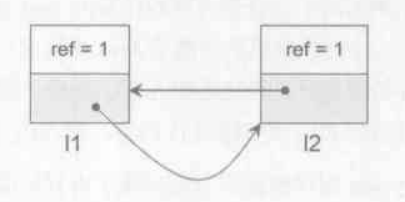
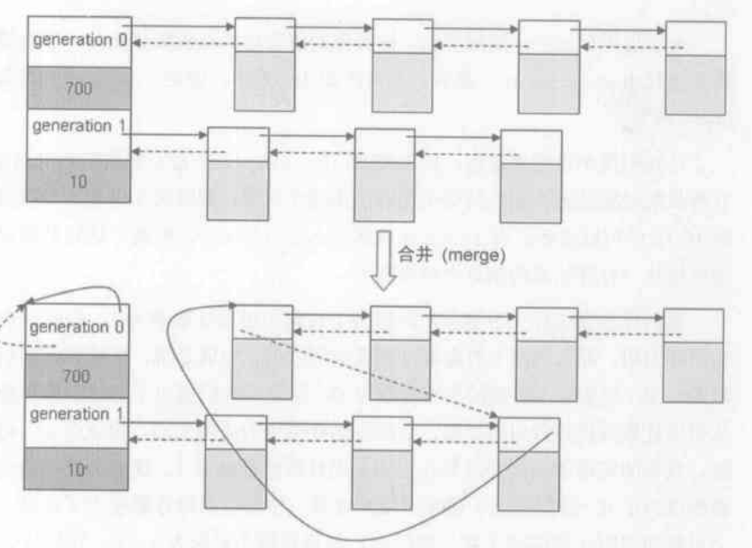

# python 垃圾回收

python 采用了以下三种方法进行垃圾回收

1. 引用计数法: 通过对数据存储的物理空间附加多一个计数器空间，当有其他数据与其相关时则加一，反之相关解除时减一，定期检查各储存对象的计数器，为零的话则认为已经被抛弃而将其所占物理空间回收。是最简单的实现，但存在无法回收循环引用的存储对象的缺陷。

2. 标记-清除法: 从根节点开始标记，然后递归标记其引用的对象，这些被标记的对象是可达的，其他的则是不可达的，最后把不可达的对象全部释放

3. 分代回收: 程序运行所需的存储对象会先存放在年轻代分区，年轻代分区会较为频密进行较为激进垃圾回收行为，每次回收完成幸存的存储对象内的寿命计数器加一。当年轻代分区存储对象的寿命计数器达到一定阈值或存储对象的占用空间超过一定阈值时，则被移动到年老代空间，年老代空间会较少运行垃圾回收行为。



## 可收集对象链表

```
typedef union _gc_head {
    struct {
        union _gc_head *gc_next;
        union _gc_head *gc_prev;
        int gc_refs; // 引用计数的副本
    } gc;
    long double dummy;
} PyGC_Head;
```

```
struch gc_generation {
    PyGC_Head head; // 当代可收集对象链表头
    int threshold; // 当代存放最大数量
    int count; // 当代已经存放的数量
}
```


1. 拥有 PyGC_Head 的对象才是可收集的对象，由 PyGC_Head 组成的双向链表被称为可收集对象链表，可回收对象创建时都会带着这个 PyGC_Head 放入可收集对象链表中

2. 由于 python 采用了分代回收算法，一共三代，因此有三条这样的可收集对象链表 gc_generation，代表三个代的对象，在 generations 数组中

3. contain 中存放的就是对象，PyGC_Head 的地址和 PyObject_Head 的地址可互相转换

4. 可收集对象链表的回收:

    1. 从高到低遍历 generations 数组，只对第一个出现 count > threshold 的代的时候会触发该代的垃圾回收(但是其实不止回收该代)
    2. 将该代和所有比他年轻的代的链表连接起来，简单来说就是把年轻代的头连接到该代的尾上，看下图好理解
    3. 遍历合并后链表进行垃圾回收



## python gc 的全过程

1. 从高到低遍历 generations 数组，获取第一个满的 generation
2. 将该 generation 和所有比他年轻(小)的 generation 链表合并起来
3. 遍历合并后的链表的 PyGC_Head，将所有的 gc_refs 赋值为 ob_refcnt(真正的引用计数)
4. 遍历合并后的链表的 Py_Object，每个 object 会调用自己的 tp_traverse(op, visit_decref, NULL)，里面会对 object 引用的所有对象采用 visit_decref 方法来减少引用计数(PyGC_Head->gc_refs 减一)，注意这个 gc_refs 只是一个副本，因此即使它变成 0，也不会触发引用计数的回收
5. 创建 unreachable 链表，遍历上一步处理过的链表，将 gc_refs=0 的 object 暂时放到 unreachable 链表，然后把 gc_refs>0 的 object 标记为 reachable，然后调用 object 的 tp_traverse(op, visit_reachable, young)，这次里面调用的方法是 visit_reachable，这个方法将已经放到 unreachable 链表中的 object 移动到原来的链表中，并标记为 reachable，再把 gc_refs 变成 1
6. 现在这个 generation 链表已经只剩下 reachable 的对象了，如果这不是最老的一代，将这个 generation 链表合并到 generation+1 的链表中，以下称为 old 链表
7. 创建 finalize 链表，遍历 unreachable 链表，将里面带有 \_\_del\_\_ 的对象及其引用到的所有对象移动到 finalize 链表中
8. 处理 unreachable 链表中的弱引用
9. 遍历 unreachable 链表，调用每个 object 的 clear 方法，里面会真正减少 ob_refcnt 来触发引用计数机制，销毁所有 unreachable 链表上的对象，如果销毁失败将其放到 old 链表
10. 将 finalize 链表合并到 old 链表

`一句话总结顺序: 合并年轻代 -> 通过 gc_refs 得到根对象 -> 从根对象出发分为 reachable 和 unreachable -> 处理特殊对象 -> 销毁 unreachable 对象 -> 未销毁对象合并到老一代`

需要注意的点

1. 带有 \_\_del\_\_ 方法的类对象无法被 gc 回收
2. 这个过程是针对循环引用的对象，即无法被引用计数法回收的对象