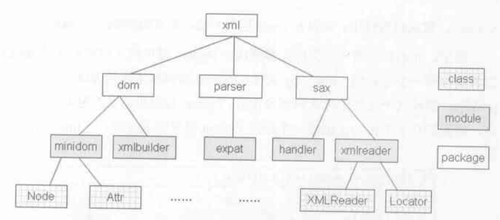

# Python 模块动态加载机制

## python 模块结构

```
typedef struct {
    PyObject_HEAD
    PyObject *md_dict;
} PyModuleObject;
```

结构有三层，就是 package -- module -- content(md_dict 中的东西) 组成的树状结构，可以看下 xml package 的结构



1. package: 形式为一个带有 \_\_init\_\_.py 的目录, 拥有 \_\_path\_\_ 属性，限制这个 package 的搜索路径
2. module: PyModuleObject，通常形式为一个 py/pyc/pyd(dll) 文件，\_\_path\_\_ = NULL
3. 区分 package 和 module 方法: 在 \_\_init\_\_.py 运行的环境是 package, 拥有 \_\_path\_\_ 属性, 其他情况都是在 module 环境，\_\_path\_\_ = NULL

## import 动作

```
import sys
0 LOAD_CONST               0 (-1)
3 LOAD_CONST               1 (None)
6 IMPORT_NAME              0 (sys)
9 STORE_NAME               0 (sys)
```

```
from a import b, c
0 LOAD_CONST               0 (-1)
3 LOAD_CONST               1 (('b', 'c'))
6 IMPORT_NAME              0 (a)
9 IMPORT_FROM              1 (b)
12 STORE_NAME               1 (b)
15 IMPORT_FROM              2 (c)
18 STORE_NAME               2 (c)
```

```
[IMPORT_NAME]
w = GETITEM(names, oparg);
x = PyDict_GetItemString(f->f_builtins, "__import__");
v = POP();
u = TOP();
res = PyInt_AsLong(u);
if (res != -1 || PyErr_Occurred()) {
    w = PyTuple_Pack(5,
        w,
        f->f_globals,
        f->f_locals == NULL ? Py_None : f->f_locals,
        v,
        u);
}
else
    w = PyTuple_Pack(4,
        w,
        f->f_globals,
        f->f_locals == NULL ? Py_None : f->f_locals,
        v);
x = PyEval_CallObject(x, w);
```

1. 首先在栈上放了两个参数，一个是 -1, 另一个是 PyNone/('b', 'c'), 这两个都是 IMPORT_NAME 需要用到的，重点看这个 IMPORT_NAME
2. IMPORT_NAME 的内容中
    1. w: 指令参数 sys/a
    2. x: 初始化时候创建的 builtin module 中的内置函数 \_\_import\_\_, 不过这时候他是被封装之后的 PyCFunctionObject
    3. v: 栈上的 PyNone/('b', 'c'), 其实就是 fromlist
    4. u: 栈上的 -1
3. PyTuple_Pack 将这 w, v, u 还有栈帧上的名字空间 local 和 global 打包成 tuple
4. PyEval_CallObject(x, w) 里面先判断几个异常情况，然后就直接进入到 PyObject_Call(x, w, NULL) 中了，只是做了一个参数传递，PyObject_Call 这个函数在函数部分有讲解过，实际上这里他会调用 x 的类型 ob_type 的 tp_call 方法，PyCFunctionObject 的类型就是 PyCFunction_Type, 而他的 tp_call 就是 PyCFunction_Call
5. PyCFunction_Call 会把 x 这个 PyCFunctionObject 拆开，得到对应的函数指针 \_\_import\_\_，然后以第 3 步的 tuple 作为参数，调用这个 \_\_import\_\_ 函数
6. 调用 PyArg_ParseTupleAndKeywords(args, kwds, "s|OOOi:\_\_import\_\_", kwlist, &name, &globals, &locals, &fromlist, &level) 将那个 tuple 拆开到后五个参数中
7. 使用 lock_import 对 import 这个动作上锁，防止多线程问题
8. 进入 import_module_level 方法，下面详细介绍这个方法
9. 使用 unlock_import，返回 import_module_level 得到的结果
10. 如果是 from import, 会进入一个或多个 IMPORT_FROM，分别调用 import_from(tail, b), import_from(tail, c), 这个 tail 是 import_module_level 的返回结果, 作用就是调用 PyObject_GetAttr(tail, b/c) 拿到我们需要的 b 和 c 放到栈上，其余的都不需要了，达到我们只 import module 中限定属性的要求, PyObject_GetAttr 在类部分有讲解
11. STORE_NAME 将栈上的结果存入 locals 名字空间中

## import_module_level

```
static PyObject *
import_module_level(char *name, PyObject *globals, PyObject *locals,
                    PyObject *fromlist, int level)
{
    char *buf;
    Py_ssize_t buflen = 0;
    PyObject *parent, *head, *next, *tail;

    buf = PyMem_MALLOC(MAXPATHLEN+1);
    parent = get_parent(globals, buf, &buflen, level); // 获取 package
    head = load_next(parent, level < 0 ? Py_None : parent, &name, buf, &buflen);
    tail = head;

    while (name) { // 循环加载模块
        next = load_next(tail, tail, &name, buf, &buflen);
        tail = next;
    }

    if (fromlist != NULL) {
        if ((fromlist == Py_None) ? 0 : PyObject_IsTrue(fromlist))
            fromlist = NULL;
    }

    if (fromlist == NULL) {
        return head;
    }

    if (!ensure_fromlist(tail, fromlist, buf, buflen, 0)) {
        return NULL;
    }

    PyMem_FREE(buf);
    return tail;
}
```

```
struct filedescr {
    char *suffix; // 后缀名
    char *mode; // 模式
    enum filetype type; // 类型
};
```

1. get_parent 方法获取当前 package, 注意是 package 而非 module, 说明 import 机制的边界在 package
2. 进入 load_next 循环
    1. 先拿到下一个要 import 的 module, 参数 &name 的变化如 (a.b.c) -- import a --> (b.c) -- import b --> (c) -- import c --> NULL。
    2. load_next 的第二个参数很特别，只有两种情况，一是 PyNone，二就是 parent 本身，作用是当我们 import 一个默认搜索路径的 module 的时候，由于 package 的路径限制，我们无法搜索外部的模块，因此当当前 package 搜索失败时会转向搜索第二个参数，当第二个参数时 None 时，就可以从默认搜索路径搜索 module 了
    3. 调用 import_submodule, 获取到当前 package 的搜索路径, 调用 find_module 搜索 module，得到的结果是一个 filedescr，包含着后缀名，模式和类型
    4. 再调用 load_module, 根据 filedescr 的类型会进行不同的加载操作，有 py, pyc, pyd 等等类型，然后往 sys.modules 这个 dict 中加入这个新加载的 module
    5. 调用 add_submodule 往当前 module 的 md_dict 中加入新加载的 module 引用
3. 如果 import 的形式是 from ... import ..., 那么 fromlist 就不为空，会返回 tail, 否则返回 head
4. 这里有个 ensure_fromlist 函数，这个函数是为了捕捉 fromlist 中没有被加载的漏网之鱼，有下面两种情况
    1. 判断是否是 from ... import * 的形式，这种形式会 import module.\_\_all\_\_ 中的所有内容
    2. 是否出现间接 import， 即 a 加载了 b, b 加载了 c, 而我们写的是 from a import c, a.md_dict 是不存在 c 的，但是只要 module->ob_type->tp_getattro 能搜到则认为是合法的，将其加载, 这个函数再类的部分有讲解


## load module

在上一节的 load_next 中会调用 load_module, 这里说一下对不同文件类型的 import 方式

- py: load_source_module

1. 先将 py 文件编译成 PyCodeObject, 在调用 PyImport_ExecCodeModuleEx 加载这个 PyCodeObject
2. 调用 PyImport_AddModule, 首先判断全局 modules 是否已经加载过这个名字的 module, 如果加载过则 goto 5, 否则 goto 3
3. 创建对应名字的 module 并放到全局的 modules 中
4. module->md_dict["\_\_builtins\_\_"] = f->f_builtins, 添加当前栈帧的 builtin 名字空间属性
5. 设置 module 的 \_\_file\_\_ 属性为文件路径
6. PyEval_EvalCode 会调用 PyEval_EvalCodeEx(co, module->md_dict, module->md_dict,...) 执行这段 PyCodeObject 字节码，函数篇有详解, 这里参数为空
7. 返回 module

- pyc: load_compiled_module

1. 读取文件头的 magic number, 判断版本是否正确
2. 读取 PyCodeObject, 并调用 PyImport_ExecCodeModuleEx 来加载它，后面的步骤与 py 文件相同

- package: load_package

1. 同样是调用 PyImport_AddModule 加载 package, 因为 package 也是一种 module
2. 设置其 \_\_file\_\_ 和 \_\_path\_\_ 属性
3. 调用 find_module 和 load_module 加载 \_\_init\_\_.py 文件，因此没有 \_\_init\_\_ 文件的目录不是 package

- pyd/dll: _PyImport_LoadDynamicModule

1. 从 modules 备份中查找是否存在同名 module, 如果有则直接返回 goto end
2. _PyImport_GetDynLoadFunc 针对不同的平台得到 module 初始化函数的起始地址，例如 win32, 它就调用 LoadLibraryEx
3. 调用初始化函数，因为我们写的 c 扩展 python 文件中会有一个初始化函数，里面会调用 Py_InitModule, 其实它就是一个 Py_InitModule4 的宏，这个函数在运行环境篇里面说明了

## 模块 reload

```
reload(stemer)
0 LOAD_NAME                0 (reload)
3 LOAD_NAME                1 (stemer)
6 CALL_FUNCTION            1
```

很简单，其实就是调用内建函数 builtin_reload -- PyImport_ReloadModule

1. 判断该 module 是否已经被加载, 如果没有就报错
2. modules_reloading 添加该 module
3. 调用 find_module 和 load_module 加载该 module

其实最后还是调用的 load_module，需要注意的是 load_module 读取 py 文件时，如果该 module 已经被加载的话那么会返回原来的 module, 这时候调用 PyEval_EvalCode 时传入的 dict 是原来的 module 的 md_dict, 所以如果你在原来的文件删除了某个属性，但是其实 reload 是不会将其删除的


## import 本质

可以看到系统一开始就加载了很多内建 module, 如 sys, 但是我们在 py 文件中依然需要 import sys 才能调用其内容，说明 import 作用主要是针对当前栈帧可见性的，例如 from x import y, 其实 x 已经加载到 sys.modules 里面了，只不过本地名字空间里面找不到而已。也是防止在程序里面反复加载某个 module 的策略