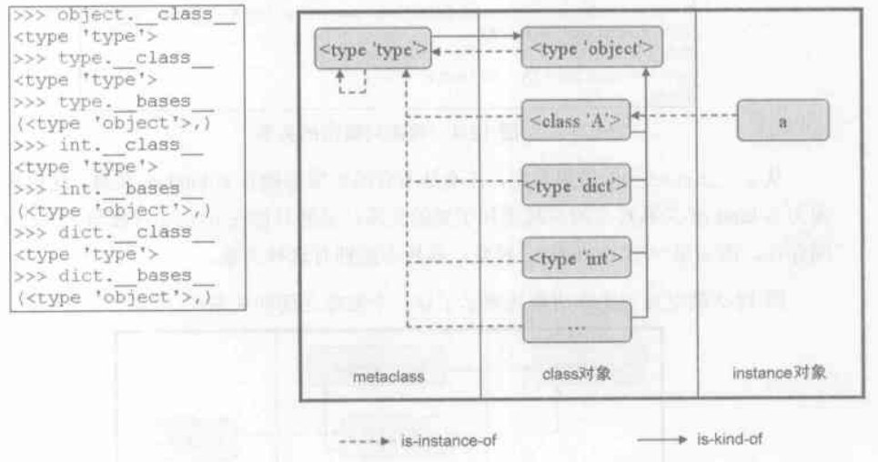
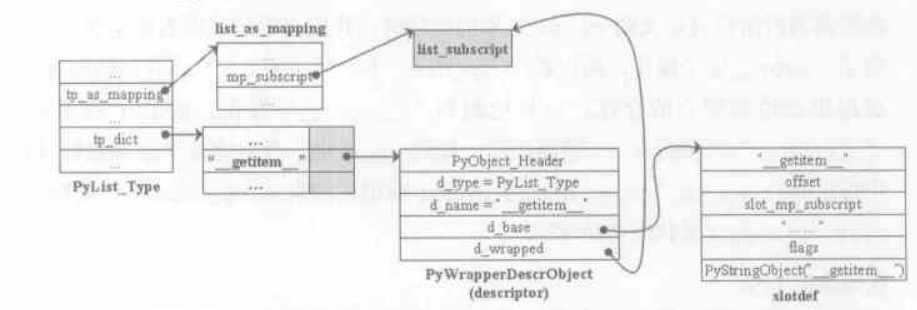
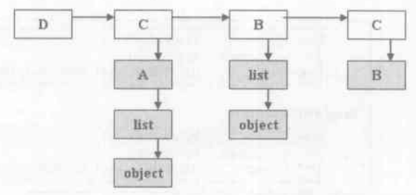
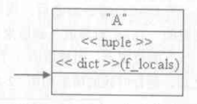
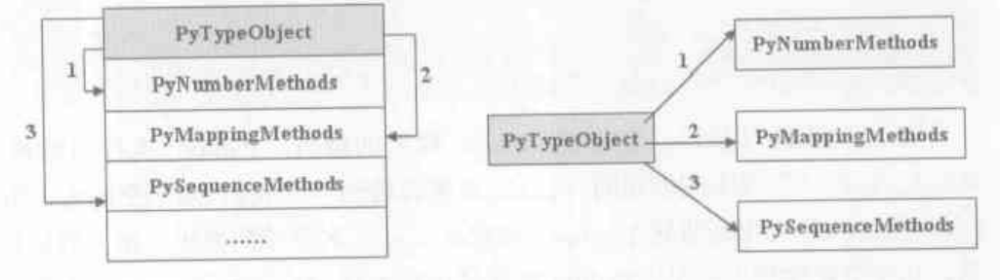
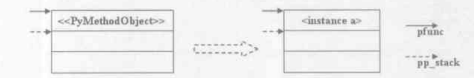
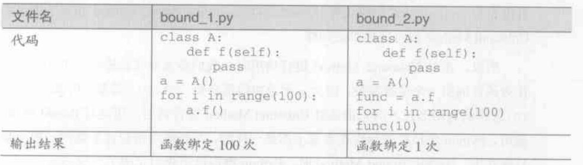

# python 类机制

python 有两套类机制，一套为 classic class, 另一套为 new style class, 随着 python 演进 classic class 最终消失，所以这里只讨论 new style class

## 对象模型

- type 对象: 表示 python 内置的类型
- class 对象: 表示 python 程序员自定义的类型
- instance 对象: 表示由 class 对象创建的实例

在 python 2.2 之后，为了能让内置类型 type 也能被继承，就把 type 和 class 统一了概念，这种机制就称为 new style class，还有需要注意的是 python 中万物皆对象，所以类型 class 本身也是一个对象, 一个 class 或者 type 对象的类型为 PyTypeObject

- 类型和对象间的关系

    - is-kind-of: 子类 is-kind-of 父类, 用 `__bases__` 可以查看
    - is-instance-of: class A 创建的对象 a is-instance-of A, 用 `__class__` 可以查看

    
    上图是关系图，注意两个特殊的对象 \<type 'type'\> 和 \<type 'object'\>

    - \<type 'type'\>: PyType_Type，默认的 metaclass 对象，\<type 'type'\> 的 metaclass 也是 \<type 'type'\> 自己，metaclass 是类创建对象的关键
    - \<type 'object'\>: PyBaseObject_Type，默认的父类，所有类对象的根父类, object 本身没有父类
    - 所以上图我认为应该这样理解，所有 object 以外的 class 和 type 对象最终继承父类都是 \<type 'object'\>, 所有 class 和 type 对象的默认 metaclass 都是 \<type 'type'\>

## 内置类型 type 存储方法和 class 统一的机制

在之前内置类型 type 和自定义类型 class 概念是分开的，而 type 是不能被继承的，现在是可以了，答案就是下面这个机制，tp_dict 中存放的是包含的 slot 的 descriptor，继承内置方法的时候也是替换这个 slot 的方法，下面会详细解释

- slot: 能表示一个 PyTypeObject 中定义的操作，如 \_\_add\_\_

```
typedef struct _heaptypeobject {
    PyTypeObject ht_type;  // 类型对象
    PyNumberMethods as_number;
    PyMappingMethods as_mapping;
    PySequenceMethods as_sequence;
    PyBufferProcs as_buffer;
    PyObject *ht_name, *ht_slots;
} PyHeapTypeObject;
```

```
typedef struct wrapperbase slotdef;
struct wrapperbase {
    char *name; // 操作的名称, 如 __add__
    int offset; // 操作的函数地址在 PyHeapTypeObject 中的偏移量
    void *function; // slot function 函数
    wrapperfunc wrapper;
    char *doc;
    int flags;
    PyObject *name_strobj; // name 对应的 PyStringObject 对象
};
```

```
#define TPSLOT(NAME, SLOT, FUNCTION, WRAPPER, DOC) (NAME, offsetof(PyTypeObject, SLOT), (void*)FUNCTION, WRAPPER, PyDoc_STR(DOC))
#define ETSLOT(NAME, SLOT, FUNCTION, WRAPPER, DOC) (NAME, offsetof(PyHeapTypeObject, SLOT), (void*)FUNCTION, WRAPPER, PyDoc_STR(DOC))
#define SQSLOT(NAME, SLOT, FUNCTION, WRAPPER, DOC) ETSLOT(NAME, as_squence.SLOT, FUNCTION, WRAPPER, DOC)
......

static slotdef slotdefs[] = {
    .....
    SQSLOT("__getitem__", sq_item, slot_sq_item, wrap_sq_item, "x.__getitem__(y) <==> x[y]"),
    MPSLOT("__getitem__", mp_subscript, slot_mp_subscript, wrap_binaryfunc, "x.__getitem__(y) <==> x[y]"),
    .....
}
```

1. slotdef(wrapperbase) 就是实现 slot 的结构，其中 offset 属性代表操作的函数地址在 PyHeapTypeObject 中的偏移量, 可以看 ETSLOT 宏就是这样写的，TPSLOT 虽然用的是 PyTypeObject 的 offset，但是在 PyHeapTypeObject 内存中第一个属性就是 PyTypeObject，因此这个 offset 也是相对于 PyHeapTypeObject
2. slotdef 的 offset 是用于排序的, 从最后一段代码可以看出，在 slotdefs 数组中同一个操作 "\_\_getitem\_\_" 是会出现多个 slot 的，其中 MPSLOT 和 MPSLOT 都是包装了 ETSLOT 的宏，因此这里采用优先度更高的 slot，排序的方法就是看 offset，offset 越小，优先度越高，上面例子中，明显在 PyHeapTypeObject 里面 offset(as_mapping) < offset(as_sequence), 因此会选择 MPSLOT

- descriptor: 包含 slot 的结构，它是一个 PyObject

```
typedef struct {
    PyObject_HEAD
    PyTypeObject *d_type; // 当前类对象
    PyObject *d_name; // slot 的 name, 操作的名称
    struct wrapperbase *d_base; // slotdef 对象
    void *d_wrapped; // 操作对应的函数指针，函数真正的地址
} PyWrapperDescrObject;
```

## 类型的初始化

python 在启动时会调用 \_Py\_ReadyTypes 来初始化对象模型，里面会调用 PyType_Ready 对 class 对象初始化，以下类型对象简称 type

- PyType_Ready

1. 获得基类 type->tp_base, 若为空并且这个类不是 object 类的话，将默认 tp_base = &PyBaseObject_Type, 所以说所有类的根父类都是 object，有一点要注意的就是 python 是支持多重继承的，所以这个 tp_base 中可能不止一个类
2. 如果基类还没有初始化 (tp_dict == NULL) 那么就调用 PyType_Ready 初始化基类
3. 如果 type->ob_type == NULL, 那么 ob_type 会赋值为父类的 ob_type, 由于 PyBaseObject_Type 的 ob_type 就是 PyType_Type，所以一般不指定 metaclass 的类的 metaclass 都是 \<type 'type'\>
4. 获取基类列表 type->tp_bases, 也就是我们访问的 \_\_bases\_\_, 如果为空则先判断 tp_base，如果也是为空就赋值为一个空的 tuple, 否则赋值为 tp_base 中所有类组成的 tuple
5. 获取 type->tp_dict, 如果为空则新建一个 dict 对象作为 tp_dict
6. 调用 add_operators: 首先将 slotdefs 的所有 slot 进行排序，再遍历 slotdefs, 如果 slot->wrapper == NULL 就不处理，先获取操作对应函数的指针 ptr，这个是函数真正的地址, 又判断 type->tp_dict 是否存在该操作名 slot->name_strobj 的 key，如果存在则放弃，否则就使用 type, slot, ptr 创建一个 PyWrapperDescrObject descr，最后将 (slot->name_strobj, descr) 这个 key-value 存入 type->tp_dict 中
7. 继续调用 add_methods, add_members, add_getsets 添加 tp_methods, tp_members, tp_getsets, 具体过程和 add_operators 类似，不过 descriptor 的类型变成了 PyMethodDescrObject, PyMemberDescrObject, PyGetsetDescrObject
8. 最后是继承，建立 mro, 基于 mro 继承操作，设置基类的子类列表，这个下面就讲到了

举个例子，list 类初始化的结构如下图



- 内置方法的重写

在 python 我们可以自己重写类的内置方法，如 `__init__`, `__repr__` 等

`TPSLOT("__repr__", tp_repr, slot_tp_repr ....)`

1. python 会在初始化类的时候检查 type->tp_dict 是否存在 \_\_repr\_\_, 只要我们重写了就会存在，因此在检查到的时候会从上面这个 slot 找到 tp_repr 并将这个指针改为 slot 中的 slot_tp_repr, 因此当我们执行 \_\_repr\_\_ 时，执行的是 slot_tp_repr
2. slot_tp_repr 则会调用 lookup_method 去搜索我们重写的方法，下面有讲到这个方法，之后调用这个方法，其余的内置方法重写原理也是相同的

## 类继承

- mro (Method Resolve Order)

```
class A(list):
    def show(self):
        print "A::show"

class B(list):
    def show(value):
        print "B::show"

class C(A):
    pass

class D(C, B):
    pass

d = D()
d.show() // 输出 "B::show"
```



类的继承就是靠这个 mro 实现的，他是如何生成的呢？举个简单例子，上图的这个结构就是类 D 建立 mro 对象 (tp_mro) 时用到的辅助列表, 图中最右边的 C->B 是类 D 的直接基类列表，其余的话，灰色的部分代表上面白色部分的 mro 列表，下面讲解一下放置的步骤，获得的元素都是从图中这个辅助列表中来

1. 首先获得 D, tp_mro 中没有 D, 放入 D
2. 获得 C, tp_mro 中没有 C, 放入 C, 但是发现 C 拥有 tp_mro, 因此访问 C 的 mro 列表
    1. 获得 A, tp_mro 中没有 A, 放入 A
    2. 获得 list, 由于后面 B 的 mro 列表中也出现了 list 因此先不处理
    3. 获得 object, 和 list 同一个原因先不处理
3. 获得 B, tp_mro 中没有 B, 放入 B, 同样访问 B 的 mro 列表
    1. 获得 list, tp_mro 中没有 list, 放入 list
    2. 获得 object, tp_mro 中没有 object, 放入 object
4. 最后得出结果 tp_mro = (D, C, B, A, list, object)

- 继承基类 slot

1. 建立 mro
2. 遍历我们刚才得出的 mro, 由于第一个是类自己本身，所以从第二个开始
3. 对每一个 mro 中的基类调用 inherit_slots 将 type 本身没有的内置方法复制为基类 type->tp_base 拥有的内置方法，这里继承的方法暂时还都是内置方法，因此方法的名字都是写死在代码里面的，如 `COPYNUM(nb_add)` 就是继承 nb_add 方法
4. 遍历 type->bases, 将 type 放入基类 supertype->tp_subclasses 中

## 自定义类

```
class A(object):
0 LOAD_CONST               0 ('A')
3 LOAD_NAME                0 (object)
6 BUILD_TUPLE              1
9 LOAD_CONST               1 (<code object A at 00000000032A9430, file ".\test.py", line 1>)
12 MAKE_FUNCTION            0
15 CALL_FUNCTION            0
18 BUILD_CLASS
19 STORE_NAME               1 (A)
22 LOAD_CONST               2 (None)
25 RETURN_VALUE

    0 LOAD_NAME                0 (__name__)
    3 STORE_NAME               1 (__module__)

    name = 'Python'
    6 LOAD_CONST               0 ('Python')
    9 STORE_NAME               2 (name)

    def __init__(self):
    12 LOAD_CONST               1 (<code object __init__ at 0000000002EA9530, file ".\test.py", line 3>)
    15 MAKE_FUNCTION            0
    18 STORE_NAME               3 (__init__)

    def f(self):
    21 LOAD_CONST               2 (<code object f at 0000000002EA9330, file ".\test.py", line 5>)
    24 MAKE_FUNCTION            0
    27 STORE_NAME               4 (f)

    30 LOAD_CONST               3 (<code object g at 0000000002EA93B0, file ".\test.py", line 7>)
    33 MAKE_FUNCTION            0
    36 STORE_NAME               5 (g)

    39 LOAD_LOCALS
    40 RETURN_VALUE
```

1. 前三行字节码指令生成一个 ('A', object) 的 tuple 并压入栈顶，第四行把 class A 对应的 PyCodeObject 压入栈顶，然后用 MAKE_FUNCTION 创建一个 PyFunctionObject, 然后立刻就执行 CALL_FUNCTION，其实就是执行了 class 里面的代码对应的字节码, 详细过程可以看函数部分
2. CALL_FUNCTION 执行的字节码里面看到很多熟悉的命令，前两句 LOAD_NAME 和 STORE_NAME 就是 \_\_module\_\_ = \_\_name\_\_(\_\_name\_\_ == "\_\_main\_\_") , 然后创建了三个函数 \_\_init\_\_, f, g, 都放到了 f_locals 这个名字空间中
3. LOAD_LOCALS: 将 f_locals 整个压入栈顶, 然后 RETURN_VALUE 将其返回到 CALL_FUNCTION 处，CALL_FUNCTION 再将这个 f_locals 压到运行时栈上, 此时运行栈情况如下图
4. BUILD_CLASS: 调用 build_class 方法创建 class 对象 A，下面我们会详细讲这个函数
5. 最后把 A 这个对象保存在 f_locals 了，这里没有使用它就直接返回了



- build_class(PyObject *methods, PyObject *bases, PyObject *Name)

1. 从 methods 对象中尝试获取 `__metaclass__`, 可以看出三个参数就是栈上的三个对象，而这个 methods 就是刚才放到栈上的 dict(f_locals)，如果没有，则从 bases 中得到第一基类的 `__class__` 属性作为自己 metaclass 了
2. 调用 PyCallFunctionObjArgs(metaclass, name, bases, methods, NULL) 将参数中的类名，基类列表，类属性列表打包成一个 tuple，然后调用 PyObject_Call
3. PyObject_Call 会调用 metaclass 的 tp_call 函数，我们这里的 metaclass 是一般的 PyType_Type, 它的 tp_call 为 type_call(type, args, kwds), 这里的 type 参数是 PyType_Type, 而 args 就是上一步打包的 tuple。这里顺便介绍一下 python 的 callable 机制，只要对象设置了 tp_call 函数就是可调用的，我们建立对象时用的 A() 其实是调用了类对象 A 的 tp_call
4. type_call 调用 PyType_Type 的 tp_new(metatype, args, kwds), 这个 tp_new 就是 type_new 方法, 后面的所有步骤都在 type_new 方法中实现
5. type_new 方法首先将 args 拆分回 name, bases, methods, 然后通过 metatype 得到最佳 metaclass(\<type 'type'\>), 通过 bases 得到最佳基类 base(\<type 'object'\>)
6. 调用 metatype->tp_alloc 为 class 对象申请内存, 注意 \<type 'type'\> 是没有 tp_alloc 方法的，但是它继承的 \<type 'object'\> 是有的，所以这里调用的是 object 的 PyTypeGeneric_Alloc, 申请的内存大小为 metatype->tp_basicsize + metatype->tp_itemsize, 或者这样写 sizeof(PyHeapTypeObject) + sizeof(PyMemberDef)
7. 将 PyHeapTypeObject 地址也设置为  class 对象首地址，设置 PyHeapTypeObject 的 name 为 args 的 name, 然后再设置 class 对象 tp_as_number, tp_as_sequence, tp_as_mapping, tp_as_buffer 为 PyHeapTypeObject 的 as_number, as_sequence, as_mapping, as_buffer
8. 设置 class 对象的 tp_name, tp_bases, tp_base, 将 args 中的 methods 属性列表拷贝到 tp_dict 中
9. 如果 methods 属性列表中存在 `__new__`, 那么将 `__new__` 对应的函数改造为 static 函数，再覆盖 tp_dict 中的 `__new__` 函数
10. 为 class 对象对应的 instance 实例对象设置内存大小信息 type->tp_basicsize, 这个内存大小为: 基类 base->tp_basicsize + 8, 后面的 8 是分给了 tp_dictoffset 和 tp_weaklistoffset, 再设置 type->tp_itemsize = base->tp_itemsize
11. 调用 PyType_Ready 对 class 对象初始化，这个函数前面已经有详细讲解了, 至此，class 对象就成功的创建了

- 内置类型和自定义类型对比


左边是自定义类型的内存结构，右边是内置方法的内存机构，区别在于自定义类型申请的内存是连续的，而内置类型的内存位置是在编译时确定的，因此内存位置是离散的

## 类创建实例对象

```
a = A()
0 LOAD_NAME                0 (A)
3 CALL_FUNCTION            0
6 STORE_NAME               1 (a)
```

```
static PyObject* call_function(PyObject ***pp_stack, int oparg)
{
    .....
        if (PyFunction_Check(func))
            x = fast_function(func, pp_stack, n, na, nk);
        else
            x = do_call(func, pp_stack, na, nk);
        ...
    ...
}
```

1. CALL_FUNCTION 会调用 call_function，这里重新再看一下这个 call_function, 当 PyFunction_Check 判断到这个 A 不是函数时，就会调用 do_call，实际上 do_call 里面会调用 PyObject_Call, 就是 build_class 的第二步，最后会调用 PyType_Type.type_call(type, args, kwds), 只不过这里的 type 参数是类型 A 的 class 对象，所以会调用 A.tp_new, 而这个 tp_new 又是在 PyType_Ready 继承 object 的，因此其实最终调用的是 PyBaseObject_Type.tp_new 也就是 object_new 方法
2. 在 object_new 中调用的 A.tp_alloc, 但是这个也是继承自 object 的，就是 PyTypeGeneric_Alloc，申请的内存为 build_class 中第 10 步设置的大小，这里是 base->tp_basicsize + 8 = object->tp_basicsize + 8 = sizeof(PyObject) + 8 = 24 字节
3. 之后会返回到 PyType_Type.type_call 中，调用 PyType_Type.tp_init, 虽然这个函数也是在 PyType_Ready 中继承了 object 的 object_init(什么也不做))，但是由于我们重写了 \_\_init\_\_ 方法，因此 tp_init 指向的是 slot_tp_init, 最后就会调用我们自己重写的 \_\_init\_\_ 方法啦


## 对象的属性访问

```
a.f()
0 LOAD_NAME              0 (a)
3 LOAD_ATTR                1 (f)
6 CALL_FUNCTION            0
9 POP_TOP
```

- 整个访问属性的流程就在 LOAD_ATTR 中, LOAD_ATTR 调用了 a 的类型 A 的方法 A.tp_getattro(a, 'f'), 下面是伪代码

```
# lookup_method 遍历 a 的类型 A 的 mro, 从 mro 每一个类中的 tp_dict 中搜索 f
if lookup_method(A, 'f'):
    f_obj = A.f
type = f_obj.__class__

# 当 f_obj 对应类型 type 同时有 __get__ 和 __set__方法时，优先使用 f_obj 对应类型的 __get__ 方法
if has_method(type, '__get__') and has_method(type, '__set__') or 'f' not in a.__dict__:
    return type.__get__(f_obj, a, A)

# 再从对象 a.__dict__ 中寻找 f
if 'f' in a.__dict__:
    return a.__dict__['f']

# a.__dict__ 也找不到属性，使用 f_obj 对应类型的 __get__ 方法
if f_obj:
    return type.__get__(f_obj, a, A)

# 如果连 __get__ 方法都没有
return f_obj
```

1. \_\_dict\_\_: 记得前面我们说在申请对象的内存中，多出来的字节有个 tp_dictoffset，这个就是这个 \_\_dict\_\_ 相对于对象的偏移，\_\_dict\_\_ 在我们第一次设置属性的时候创建
2. lookup_method 函数是会在 mro 中寻找属性的，因此会继承基类属性
3. descriptor 类: 注意这个概念和我们之前说的 descriptor 对象不一样的，这里是指伪代码中的 type 如果有 '\_\_get\_\_', '\_\_set\_\_', '\_\_delete\_\_' 中的一个或多个，则称 type 为一个 descriptor，当同时拥有 '\_\_get\_\_', '\_\_set\_\_' 的类称为 data descriptor，可以看到他的优先级是最高的

- 当对象是一个 class 对象的时候，如 A.f()，因为 class A 本身也是一个对象，它的类型是 PyType_Type，因此它调用的是 PyType_Type.tp_getattro(A, 'f')

```
# lookup_method 遍历 A 的类型 PyType_Type 的 mro, 从 mro 每一个类中的 tp_dict 中搜索 f
if lookup_method(PyType_Type, 'f'):
    f_metaobj = PyType_Type.f
metatype = f_metaobj.__class__

# 当 f_metaobj 对应类型 metatype 同时有 __get__ 和 __set__方法时，优先使用 f_metaobj 对应类型的 __get__ 方法
if has_method(metatype, '__get__') and has_method(metatype, '__set__') or 'f' not in a.__dict__:
    return metatype.__get__(f_metaobj, A, PyType_Type)

# lookup_method 遍历 A 自己的 mro, 从 mro 每一个类中的 tp_dict 中搜索 f
if lookup_method(A, 'f'):
    f_obj = PyType_Type.f
type = f_obj.__class__

# 如果 f_obj 对象类型 type 有 __get__ 方法
if has_method(type, '__get__'):
    return type.__get__(f_metaobj, NULL, A)

# 如果 f_obj 对象类型 type 没有 __get__ 方法，调用 PyType_Type 的 __get__
if has_method(metatype, '__get__')
    return metatype.__get__(f_metaobj, A, PyType_Type)

# 如果都没有
return f_metaobj
```

## self 的绑定

类的函数参数里面一般都存在一个 self 来代表调用对象本身的，那么它是如何将对象绑定到 self 的呢？这时候就需要一个新的对象 PyMethodObject 了，下面讲解用回上一个例子 a.f()

```
typedef struct {
    PyObject_HEAD
    PyObject *im_func;   /* 函数对象 PyFunctionObject */
    PyObject *im_self;   /* 这个就是我们的 self(a) */
    PyObject *im_class;  /* class 对象(A) */
    PyObject *im_weakreflist; /* List of weak references */
} PyMethodObject;
```

```
static PyObject* call_function(PyObject ***pp_stack, int oparg)
{
    int na = oparg & 0xff;
    int nk = (oparg >> 8) & 0xff;
    int n = na + 2 * nk;
    PyObject **pfunc = (*pp_stack) - n - 1; // 指向栈顶
    PyObject *func = *pfunc // 指向我们栈顶的 method
    PyObject *x, *w;

    if (PyCFunction_Check(func) && nk == 0) {
        ...
    }
    else {
        if (PyMethod_Check(func) && PyMethod_GET_SELF(func) != NULL) {
            PyObject *self = PyMethod_GET_SELF(func);
            PCALL(PCALL_METHOD);
            PCALL(PCALL_BOUND_METHOD);
            Py_INCREF(self);
            func = PyMethod_GET_FUNCTION(func); // 保留栈顶函数的引用
            Py_INCREF(func);
            Py_SETREF(*pfunc, self); // 替换栈顶为 self
            na++;
            n++;
        }
        if (PyFunction_Check(func))
            x = fast_function(func, pp_stack, n, na, nk);
        else
            x = do_call(func, pp_stack, na, nk);
        ...
    }
    ...
}
```

1. LOAD_ATTR 之后，我们最后放到栈上的是 PyMethodObject 而不是 PyFunctionObject
    ，PyFunctionObject 的类型是 PyFunction_Type, 他拥有 '\_\_get\_\_' 而没有 '\_\_set\_\_', 所以我们先看 a.\_\_dict\_\_, 发现没有，因此最后调用的是 PyFunction_Type.\_\_get\_\_ 方法，这个方法会将 PyFunctionObject 包装成 PyMethodObject，当中就会出现 im_self = a，还有其他的赋值操作，最后将这个封装好的 PyMethodObject 放到栈上

2. CALL_FUNCTION: 回顾一下函数的部分，CALL_FUNCTION 调用 call_function, 这里有一个判断 `PyMethod_Check(func) && PyMethod_GET_SELF(func) != NULL`, 如果是 PyMethodObject 的话，就会把栈顶上的对象替换成这个 self 的对象，并将 n 和 na 加一，这相当于为函数提供了一个位置参数，而这个参数就是我们栈顶上的 self, 替换如下图



- 注意 method 的绑定是存在开销的, 所以在多次调用某个函数之前最好先提取出来

