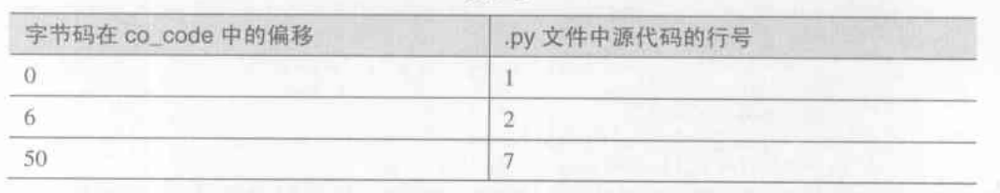

# Python 的编译结果--Code 对象和 pyc 文件

## PyCodeObject

PyCodeObject 是 python 编译后对应原代码的字节码集合对象，是 python 运行时真正使用的对象

```
typedef struct {
    PyObject_Head
    int co_argcount; // 位置参数个数
    int co_nlocals; // 局部变量的个数，包括参数个数
    int co_stacksize; // 执行这段代码需要的栈空间大小
    int co_flags;
    PyObject* co_code; // 字节码指令序列，以 PyString_Object 形式存在
    PyObject* co_consts; // tuple 对象，存放所有常量
    PyObject* co_names; // tuple 对象，存放所有符号
    PyObject* co_varnames; // 局部变量名集合
    PyObject* co_freevars; // 闭包会用到
    PyObject* co_cellvars; // 嵌套函数中的局部变量名集合
    PyObject* co_filename; // .py 文件路径
    PyObject* co_name; // 当前代码段名称，一般是类名或者函数名
    int co_firstlineno; // 当前代码段对应 .py 文件的起始行
    PyObject* co_lnotab; // 字节码指令和 .py 文件中行数的对应关系，以 PyString_Object 形式存在
    void* co_zombieframe; // 用于优化
} PyCodeObject;
```

- co_lnotab


上表对应的 co_lnotab 是 '0,1,6,1,44,5', 注意这里记录的不是真正的行号，而是行号和上一个的偏移

## pyc 文件

1. python 在 import module 动态加载 py 文件时会自动生成 pyc 文件
2. pyc 文件包括三个部分:
    - magic number: 不同 python 版本的 magic number 是不同的，用于保证 python 兼容性
    - pyc 文件创建的时间信息
    - PyCodeObject 对象

3. pyc 内对象的存储方式

举个存放字符串的例子: (t, 3, 'abc')(t, 1, 'd')(R, 0)

- 每个括号里面代表一个对象，t是指对象类型为 intern string，第二个数字是长度，第三个元素是字符串内容，而 (R, 0) 代表他是引用的第0个字符串对象，即(t, 3, 'abc')，这样做可以防止对象过多重复

4. 一个 py 文件只会生成一个 pyc 文件，但是却不止一个 PyCodeObject，方法是用嵌套的结构，嵌套的 PyCodeObject 会放在 PyCodeObject 的 co_consts 中

## python 字节码

```
file = open('a.py').read
code = code.compile(file, 'a.py', 'exec')
import dis
dis.dis(code)
```

- 字节码是类似于汇编指令的一种代码，上述代码可以直接查看 python 代码对应执行的字节码，所以说用字节码修改来混淆是没有意义的，只需要用原生的 python dis 一段拥有所有字节码的代码，在用你混淆过的 python dis 一段，就可以获得字节码的映射关系表

- 字节码指令占一个字节，每一个参数占两个字节