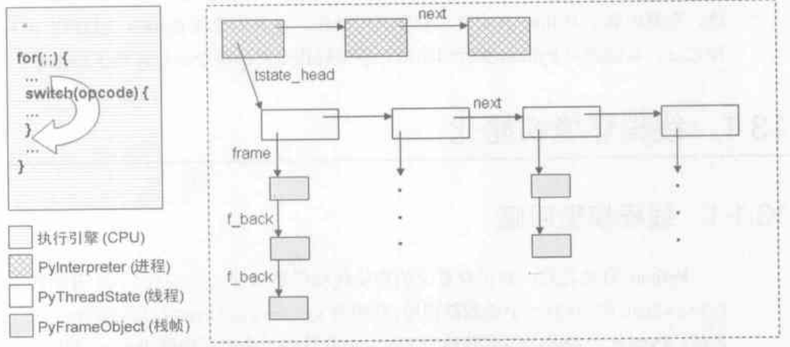
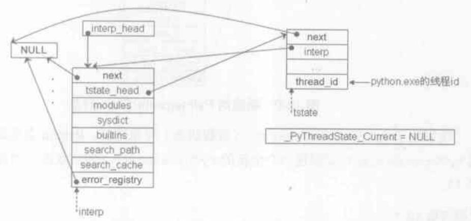
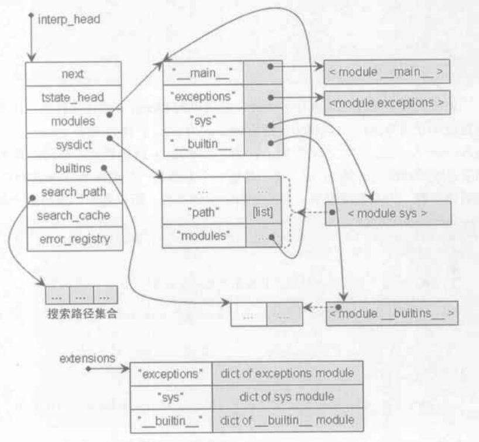

# Python 运行环境初始化

Python 初始化的内容包含在 pythonrun.c 的 Py_InitializeEx 函数中，先来看看它整体的流程

```c
_PyRandom_Init();

interp = PyInterpreterState_New();                                  // 建立进程模型
tstate = PyThreadState_New(interp);                                 // 进程中建立线程模型
PyThreadState_Swap(tstate);                                         // 切换进程的当前线程

_Py_ReadyTypes(void);                                               // 初始化全部内置类型，详情可以看类的部分

_PyFrame_Init();                                                    // 设置全局变量 builtin_object = "__builtins__", 这个会在新建栈帧 PyFrame_New 的时候用到

_PyInt_Init();                                                      // 初始化整数的内存缓冲池
_PyLong_Init();
PyByteArray_Init();
_PyFloat_Init();

// 模块初始化
interp->modules = PyDict_New();                                     // 创建全局 modules dict
interp->modules_reloading = PyDict_New();
interp->builtins = _PyBuiltin_Init();                               // 创建 __builtin__ 模块
_interp->sysdict = PySys_Init();                                    // 创建 sys 模块
_PyImport_FixupExtension("sys", "sys");                             // 备份 sys 模块
PySys_SetPath(Py_GetPath());                                        // 设置模块搜索路径
PyDict_SetItemString(interp->sysdict, "modules", interp->modules);  // 全局 module 集合就放在 sys.modules 下
_PyImport_Init();                                                   // import 机制初始化
_PyExc_Init();                                                      // 创建 exceptions 模块
_PyImport_FixupExtension("exceptions", "exceptions");               // 备份 exceptions 模块
_PyImport_FixupExtension("__builtin__", "__builtin__");             // 备份 __builtin__ 模块
_PyImportHooks_Init();

_PyWarnings_Init();

initmain();                                                         // 建立 __main__ 模块
initsite();

_PyGILState_Init(interp, tstate);                                   // 多线程 gil 环境初始化

........... // 后面还有一些标准输入输出的判断
```

## 进程环境初始化

- 外部结构

```c
// 进程
typedef struct _is {
    struct _is *next;
    struct _ts *tstate_head; // 线程链表

    PyObject *modules; // 模块集合
    PyObject *sysdict;
    PyObject *builtins;
    PyObject *modules_reloading;
    .....
} PyInterpreterState;

// 线程
typedef struct _ts {
    struct _ts *next;
    PyInterpreterState *interp;
    struct _frame *frame; // 模拟线程中的调用堆栈
    int recursion_depth;
    .......
    PyObject *dict;  /* Stores per-thread state */
    .......
    long thread_id; /* Thread id where this tstate was created */
    .......
} PyThreadState;
```

1. 每个进程拥有一个线程的链表，并且管理着一个模块集合，所以我们 python 不同线程拿到的 module 是相同的
2. 每个线程有自己的调用堆栈，大致结构如下图



- 内部关系

```c
PyThreadState *PyThreadState_Swap(PyThreadState *newts)
{
    PyThreadState *oldts = _PyThreadState_Current;
    _PyThreadState_Current = newts;
    return oldts;
}
```

在 PyInterpreterState_New() 建立进程模型和 PyThreadState_New(interp) 建立线程模型之后，使用 PyThreadState_Swap 将他们联系起来，这个很简单



## 系统模块初始化(modules)

- 模块初始化, 以 bulitin 为例

```c
static PyMethodDef builtin_methods[] = {
    {"__import__",      (PyCFunction)builtin___import__, METH_VARARGS | METH_KEYWORDS, import_doc},
    {"abs",             builtin_abs,        METH_O, abs_doc},
    {"all",             builtin_all,        METH_O, all_doc},
    {"any",             builtin_any,        METH_O, any_doc},
    ......
}

PyObject *_PyBuiltin_Init(void)
{
    .....
    mod = Py_InitModule4("__builtin__", builtin_methods,
                         builtin_doc, (PyObject *)NULL,
                         PYTHON_API_VERSION);
    dict = PyModule_GetDict(mod);
    ......
#define SETBUILTIN(NAME, OBJECT) \
    if (PyDict_SetItemString(dict, NAME, (PyObject *)OBJECT) < 0)       \
        return NULL;                                                    \
    ADD_TO_ALL(OBJECT)

    SETBUILTIN("None",                  Py_None);
    SETBUILTIN("Ellipsis",              Py_Ellipsis);
    .........
    SETBUILTIN("dict",                  &PyDict_Type);
    .........
```

1. _PyBuiltin_Init 调用 Py_InitModule4 建立了 \_\_builtin\_\_ module
    1. 调用 PyImport_AddModule，创建 \_\_builtin\_\_ module，interp->modules["\_\_builtin\_\_"] = \_\_builtin\_\_ module
    2. 对于参数中的 builtin_methods，这些是 python 的内置函数，都把他们封装成 PyCFunctionObject, 然后存放在刚创建的 \_\_builtin\_\_ module 维护的 dict 中
2. 把 builtin_methods 以外的内置函数和变量一个一个的放到该 module 维护的 dict 对象中去
3. interp->builtins = PyModule_GetDict(bimod) 把进程的 builtins 属性指向刚才创建的这个 module，结果如下图
4. 后面的 sys 初始化也是相同的步骤


- 模块备份

python 维护着一个模块备份的 dict 对象 extensions，里面存放的是 (module_name, module_dict), 如 _PyImport_FixupExtension("sys", "sys") 正是把 sys 模块的名字和维护的 dict 内容拷贝到 extensions

- 设置模块搜索路径

1. Py_GetPath() 会从环境变量等地方获取路径的集合数组
2. PySys_SetPath(Py_GetPath()) 简单来说就是 sys.path = Py_GetPath()

## \_\_main\_\_ 模块初始化

我们写 python 代码时经常有一句 `if __name__ == "__main__"`, 这个 \_\_main\_\_ 就是 initmain() 方法创建的

1. 调用 PyImport_AddModule，创建 \_\_main\_\_ module
2. 获取 \_\_main\_\_ module 维护的 dict 对象 md, md["\_\_builtins\_\_"] = \_\_builtin\_\_ module, 这里可以看到 \_\_builtins\_\_ 和 \_\_builtin\_\_ 的区别了
3. 我们在交互环境下输入 dir() 输出的正是 \_\_main\_\_ module 的内容

```python
>>> dir()
['__builtins__', '__doc__', '__name__', '__package__']
```

## 第三方模块初始化

```c
static void
initsite(void)
{
    PyObject *m;
    m = PyImport_ImportModule("site");
}
```

从代码可以看出，其实只是做了 import site 这个操作，这个第三方库就是我们的 site-package 目录了

## 初始化结果全貌



## 虚拟机运行

启动 python 的时候一般有两种方式，一种是交互式环境，就是我们直接在命令行键入 python 之后出现的，而另一种就是 python 运行一个 py 脚本文件，我们这里只讨论后一种，不够无论是那一种，最后都会调用 run_mod 方法

```c
static PyObject *run_mod(mod_ty mod, const char *filename, PyObject *globals, PyObject *locals,
         PyCompilerFlags *flags, PyArena *arena)
{
    PyCodeObject *co;
    PyObject *v;
    co = PyAST_Compile(mod, filename, flags, arena);
    if (co == NULL)
        return NULL;
    v = PyEval_EvalCode(co, globals, locals);
    Py_DECREF(co);
    return v;
}
```

1. 在前面的初始化 Py_InitializeEx 都完成了之后，会调用 PyRun_AnyFileFlags，这里分为交互式和脚本式，判断为脚本式时，进入 PyRun_SimpleFileExFlags 方法
2. 在 \_\_main\_\_ module 中设置 \_\_file\_\_ 文件名属性 filename，设置名字空间 globals = locals = \_\_main\_\_ module.dict, 然后进入 PyRun_FileExFlags 方法
3. 创建内存池 arena, 获取 py 脚本的 ast 语法树 mod，然后进入 run_mod(mod, filename, globals, locals, flags, arena) 方法
4. 编译刚才得到的 ast，然后调用 PyEval_EvalCode 在虚拟机中执行代码，PyEval_EvalCode 就是调用 PyEval_EvalCodeEx，在函数部分有详细讲解, 只不过这里参数为空