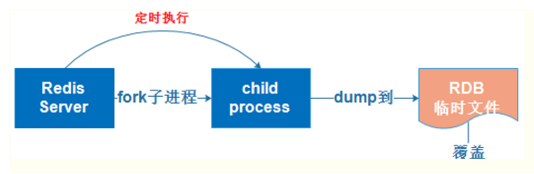
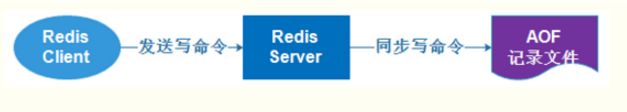

## redis 持久化主要的两种方式

1. RDB 持久化: 在指定的时间间隔内将内存中的数据集快照写入磁盘，用二进制压缩存储，每次写入成功之后替换掉之前的快照文件。从图中可以看出，写入磁盘的操作是通过 fork 一个子进程进行的。

2. AOF 持久化: 将每一次对 redis 的操作都以日志的方式记录，并同步添加到磁盘上的日志记录文件上。

---

- 两种持久化的比较:

1. 在 redis io 密集的情况下，明显 RDB 方法性能更高一些，而 AOF 由于有多次的 io 操作导致性能降低。

2. 在 redis io 数量少，但一次操作数据量大的时候，适合 AOF 一点。

3. RDB 方法恢复时间较短，只需要解压缩，但是服务器如果在关掉之前没有把内存中的新的快照写到磁盘中会导致数据缺失。

4. AOF 方法恢复时间较长，需要重新执行全部日志对应的操作，但是可靠性比 RDB 好多了，数据大概率可以完整恢复。