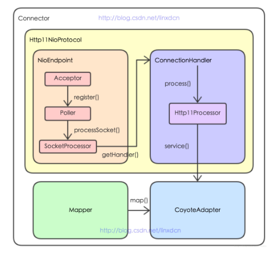

## tomcat nio 实现流程源码解析

### 0. 总览结构图



### 1. Connector初始化与启动

```
public Connector(String protocol) {

    if ("HTTP/1.1".equals(protocol) || protocol == null) {
        if (aprConnector) {
            protocolHandlerClassName = "org.apache.coyote.http11.Http11AprProtocol";
        } else {
            // 默认class name
            protocolHandlerClassName = "org.apache.coyote.http11.Http11NioProtocol";
        }
    } 

    ProtocolHandler p = null;
    try {
        // 采用反射机制创建Http11NioProtocol对象
        Class<?> clazz = Class.forName(protocolHandlerClassName);
        p = (ProtocolHandler) clazz.getConstructor().newInstance();
    }
}
```

- 新建CoyoteAdapter，并调用setAdapter()（未给出代码）。
- 创建默认类 "org.apache.coyote.http11.Http11NioProtocol" 对象。

### 2. Http11NioProtocol启动

```
public class Http11NioProtocol extends AbstractHttp11JsseProtocol<NioChannel> {

  // 新建NioEndPoint
  public Http11NioProtocol() {
      super(new NioEndpoint());

      // 父类的构造函数大致如下
      // this.endpoint = endpoint;
      // ConnectionHandler<S> cHandler = new ConnectionHandler<>(this);
      // setHandler(cHandler);
      // getEndpoint().setHandler(cHandler);
  }

  // 启动NioEndPoint
  public void start() throws Exception {
      endpoint.start();
  }
}
```

- 主要是设置Connector的handler和启动NioEndPoint。

### 3. NioEndPoint启动

```
@Override
public void startInternal() throws Exception {

    if (!running) {
        running = true;
        paused = false;

        // 新建processor,event,nioChannel的缓存栈
        processorCache = new SynchronizedStack<>(SynchronizedStack.DEFAULT_SIZE,
                socketProperties.getProcessorCache());
        eventCache = new SynchronizedStack<>(SynchronizedStack.DEFAULT_SIZE,
                        socketProperties.getEventCache());
        nioChannels = new SynchronizedStack<>(SynchronizedStack.DEFAULT_SIZE,
                socketProperties.getBufferPool());

        // 启动执行handler的process()方法的线程池
        if ( getExecutor() == null ) {
            createExecutor();
        }

        initializeConnectionLatch();

        // 启动poller线程
        pollers = new Poller[getPollerThreadCount()];
        for (int i=0; i<pollers.length; i++) {
            pollers[i] = new Poller();
            Thread pollerThread = new Thread(pollers[i], getName() + "-ClientPoller-"+i);
            pollerThread.setPriority(threadPriority);
            pollerThread.setDaemon(true);
            pollerThread.start();
        }

        // 启动acceptor线程
        startAcceptorThreads();
    }
}
```

- 这部分最主要是创建Acceptor线程池，同时监听新请求。

### 4. Acceptor监听并处理请求

```
protected class Acceptor extends AbstractEndpoint.Acceptor {

    // 启动acceptor线程
    protected final void startAcceptorThreads() {
        int count = getAcceptorThreadCount();
        acceptors = new Acceptor[count];

        for (int i = 0; i < count; i++) {
            acceptors[i] = createAcceptor();
            String threadName = getName() + "-Acceptor-" + i;
            acceptors[i].setThreadName(threadName);
            Thread t = new Thread(acceptors[i], threadName);
            t.setPriority(getAcceptorThreadPriority());
            t.setDaemon(getDaemon());
            t.start();
        }
    }

    @Override
    public void run() {

        while (running) {

            if (!running) break;

            try {
                //if we have reached max connections, wait
                countUpOrAwaitConnection();

                SocketChannel socket = null;
                try {
                    // 接收新的请求，注意！这里采用的阻塞模式，多个Acceptor线程同时阻塞在此
                    socket = serverSock.accept();
                } catch (IOException ioe) {
                    ...
                }

                if (running && !paused) {
                    if (!setSocketOptions(socket)) {
                        closeSocket(socket);
                    }
                } else {
                    closeSocket(socket);
                }
            } catch (Throwable t) {
                ...
            }
        }
    }
}
```

- Acceptor类其实继承了Runnable接口。
- 每个acceptor线程在等待serverSock.accept()时阻塞。
- 接受到信息后，调用setSocketOptions(socket)，如下：

```
protected boolean setSocketOptions(SocketChannel socket) {

    try {

        // 将SocketChannel设置为非阻塞模式
        socket.configureBlocking(false);
        Socket sock = socket.socket();

        // 设置Socket参数值，如Socket发送、接收的缓存大小、心跳检测等
        socketProperties.setProperties(sock);

        // 使用NioChannel缓存
        NioChannel channel = nioChannels.pop();
        if (channel == null) {
                channel = new NioChannel(socket, bufhandler);
        } 
        else {
            channel.setIOChannel(socket);
            channel.reset();
        }

        // 将socketChannel注册到一个poller中
        getPoller0().register(channel);

    } catch (Throwable t) {
        return false;
    }
    return true;
}
```

- 主要工作是要将SocketChannel包装成NioChannel，并调用Poller池中的某个poller的register()方法，将其注册到poller中，选择poller的规则默认是n % poller count类似的方法，用于负载均衡。

### 5. Poller处理请求

```
public class Poller implements Runnable {

    // 这就是NIO中用到的选择器，可以看出每一个Poller都会关联一个Selector  
    protected Selector selector; 

    public void register(final NioChannel socket) {
        // 绑定socket跟poller
        socket.setPoller(this);
        NioSocketWrapper ka = new NioSocketWrapper(socket, NioEndpoint.this);
        socket.setSocketWrapper(ka);
        ka.setPoller(this);

        // 使用poller缓存
        PollerEvent r = eventCache.pop();

        // 设置读操作为感兴趣的操作
        ka.interestOps(SelectionKey.OP_READ); //this is what OP_REGISTER turns into.
        if (r==null) r = new PollerEvent(socket,ka,OP_REGISTER);
        else r.reset(socket,ka,OP_REGISTER);

        // 添加到PollerEvent池
        addEvent(r);
    }

    @Override
    public void run() {
    
        while (true) {

            boolean hasEvents = false;

            try {
                if (!close) {
                    hasEvents = events();
                    if (wakeupCounter.getAndSet(-1) > 0) {
                        // wakeupCounter指event的数量，即有event
                        keyCount = selector.selectNow();
                    } else {
                        keyCount = selector.select(selectorTimeout);
                    }
                    wakeupCounter.set(0);
                }
                if (close) {
                    break;
                }
            } catch (Throwable x) {
                continue;
            }

            // either we timed out or we woke up, process events first
            if ( keyCount == 0 ) hasEvents = (hasEvents | events());

            // 根据向selector中注册的key遍历channel中已经就绪的keys
            Iterator<SelectionKey> iterator =
                keyCount > 0 ? selector.selectedKeys().iterator() : null;

            while (iterator != null && iterator.hasNext()) {
                SelectionKey sk = iterator.next();
                NioSocketWrapper attachment = (NioSocketWrapper)sk.attachment();
                if (attachment == null) {
                    iterator.remove();
                } else {
                    iterator.remove();
                    processKey(sk, attachment);
                }
            }

            //process timeouts
            timeout(keyCount,hasEvents);
        }
    }

    protected void processKey(SelectionKey sk, NioSocketWrapper attachment) {

        if (sk.isReadable() || sk.isWritable() ) {
            if ( attachment.getSendfileData() != null ) {
                processSendfile(sk,attachment, false);
            } 
            else {
                // 在通道上注销对已经发生事件的关注
                unreg(sk, attachment, sk.readyOps());
                boolean closeSocket = false;

                // 读事件
                if (sk.isReadable()) {
                    if (!processSocket(attachment, SocketEvent.OPEN_READ, true)) {
                        closeSocket = true;
                    }
                }

                // 写事件
                if (!closeSocket && sk.isWritable()) {
                    if (!processSocket(attachment, SocketEvent.OPEN_WRITE, true)) {
                        closeSocket = true;
                    }
                }
            }
        }
    }
}

public boolean processSocket(SocketWrapperBase<S> socketWrapper,
            SocketEvent event, boolean dispatch) {
    try {
        // 使用processor缓存
        SocketProcessorBase<S> sc = processorCache.pop();
        if (sc == null) {
            sc = createSocketProcessor(socketWrapper, event);
        } else {
            sc.reset(socketWrapper, event);
        }

        // 获取执行handler的线程池
        Executor executor = getExecutor();
        if (dispatch && executor != null) {
            executor.execute(sc);
        } else {
            sc.run();
        }
    } catch (RejectedExecutionException ree) {
        return false;
    }
    return true;
}
```

- register()：把socket与该poller关联，并为socket注册感兴趣的读操作，包装成PollerEvent，添加到PollerEvent池中。
- run()：循环获取PollerEvent池中的事件，然后调用selector的select()函数，获取就绪事件，遍历channel上就绪的key，交给processKey()处理
- processKey()：处理key对应的channel，调用NioEndPoint的processSocket()
- processSocket()：关联socketWrapper，提交运行SocketProcessor

### 6. SocketProcessor

```
@Override
protected void doRun() {
    NioChannel socket = socketWrapper.getSocket();
    SelectionKey key = socket.getIOChannel().keyFor(socket.getPoller().getSelector());

    // Process the request from this socket
    if (event == null) {
        // 调用了ConnectionHandler的process方法
        state = getHandler().process(socketWrapper, SocketEvent.OPEN_READ);
    } else {
        state = getHandler().process(socketWrapper, event);
    }
}
```

- 其实SocketProcessor的代码比较简单，本质上是调用了ConnectionHandler的process方法处理socket。

### 7. ConnectionHandler处理事件

```
protected static class ConnectionHandler<S> implements AbstractEndpoint.Handler<S> {
    @Override
    public SocketState process(SocketWrapperBase<S> wrapper, SocketEvent status) {

        S socket = wrapper.getSocket();

        // 1 获取socket对应的Http11NioProcessor对象，用于http协议的解析
        Processor processor = connections.get(socket);

        // 2 循环解析socket的内容，直到读完
        do {
            state = processor.process(wrapper, status);

            // ...省略超级大一段代码
        } while ( state == SocketState.UPGRADING);
    }
}
```

- 获取socket对应的Http11NioProcessor对象，用于http协议的解析
- 循环解析socket的内容，直到读完
- 后续就是包装成request和response交给CoyoteAdapter
- 之后的过程可以看 "./tomcat 请求过程.md"