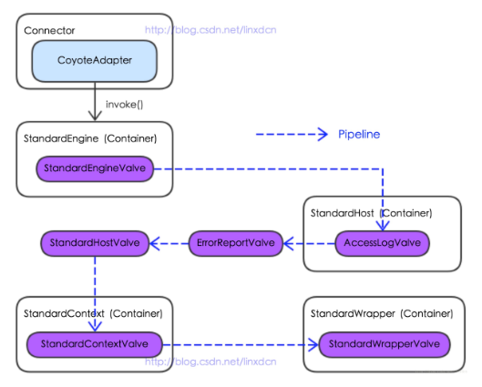

## tomcat 请求过程

1. Connector阶段：(详看"./tomcat nio.md")

2. Container阶段：

- 过程图：

- 详细流程：

  1. StandardEngineValve：StandardEngine中的唯一阀门，主要用于从request中选择其host映射的Host容器StandardHost

  2. AccessLogValve：StandardHost中的第一个阀门，主要用于管道执行结束之后记录日志信息

  3. ErrorReportValve：StandardHost中紧跟AccessLogValve的阀门，主要用于管道执行结束后，从request对象中获取异常信息，并封装到response中以便将问题展现给访问者
  
  4. StandardHostValve：StandardHost中最后的阀门，主要用于从request中选择其context映射的Context容器StandardContext以及访问request中的Session以更新会话的最后访问时间

  5. StandardContextValve：StandardContext中的唯一阀门，主要作用是禁止任何对WEB-INF或META-INF目录下资源的重定向访问，对应用程序热部署功能的实现，从request中获得StandardWrapper

  6. StandardWrapperValve：StandardWrapper中的唯一阀门，主要作用包括调用StandardWrapper的loadServlet方法生成Servlet实例和调用ApplicationFilterFactory生成Filter链

  7. 最终将Response返回给Connector完成一次http的请求