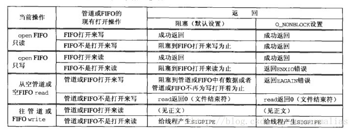

# 进程间通信 (Inter-Process Communication/IPC) 方式说明

## 1. 管道(pipe)：

概述：管道是一种半双工的通信方式，数据只能单向流动，而且只能在具有亲缘关系的进程间使用。进程的亲缘关系通常是指父子进程关系。

例子:

```
int fd[2]; // 建立两条管道，一条写，一条读
if((pid = fork()) < 0) // fork()创建子线程
    {
        perror("Fail to fork");
        exit(EXIT_FAILURE);

    }else if(pid == 0){
        close(fd[1]); // 关闭写管道
        child_read_pipe(fd[0]); // 子进程调用 read(fd,buf,sizeof(buf)) 读取管道中数据，如果没有数据，read会阻塞到管道中有数据为止
    }else{
        close(fd[0]); // 关闭读管道
        father_write_pipe(fd[1]); // 父进程调用 write(fd,buf,strlen(buf)) 往管道写数据
    }
}
```

## 2. 命名管道(FIFO)：

概述：有名管道也是半双工的通信方式，但是它允许无亲缘关系进程间的通信。

例子:

```
int readfd = open(FIFO_PATH, O_RDONLY); // 一个进程开启只读模式，如果下面的writefd没有open，这个方法会被阻塞
read(readfd, buf, sizeof(buf));
close(readfd);

int writefd = open(FIFO_PATH, O_WRONLY); // 一个进程开启只写模式，如果上面面的readfd没有open，这个方法会被阻塞
write(writefd, temp, strlen(temp) + 1);  
close(writefd);
```

- FIFO_PATH是通道对应文件路径名
- 阻塞模式下，只有当读写两个模式的通道都有开启，open方法才不会出现阻塞

###  在这里插入一个pipe和FIFO中阻塞和非阻塞模式的对比图



图中SIGPIPE信号会终止该线程

## 3. 消息队列(MessageQueue)：

概述：消息队列是由消息的链表，存放在内核中并由消息队列标识符标识。消息队列克服了信号传递信息少、管道只能承载无格式字节流以及缓冲区大小受限等缺点。如rabbitMq，kafka。

## 4. 共享存储(SharedMemory)：

概述：共享内存就是映射一段能被其他进程所访问的内存，这段共享内存由一个进程创建，但多个进程都可以访问。共享内存是最快的 IPC 方式，它是针对其他进程间通信方式运行效率低而专门设计的。它往往与其他通信机制，如信号量，配合使用，来实现进程间的同步和通信。

## 5. 信号量(Semaphore)：

概述：信号量是一个计数器，可以用来控制多个进程对共享资源的访问。它常作为一种锁机制，防止某进程正在访问共享资源时，其他进程也访问该资源。因此，主要作为进程间以及同一进程内不同线程之间的同步手段。

例子:

```
Semaphore semaphore = new Semaphore(5, true); // 创建一个数量为5的信号量
semaphore.acquire(1); // 获取数量1的信号，如果semaphore的信号已被获取完或者数量不够，则会阻塞
semaphore.release(1); // 释放数量1的信号
```

## 6. 套接字(Socket)：

概述：套解口也是一种进程间通信机制，与其他通信机制不同的是，它可用于不同及其间的进程通信。如tcp，udp及其上层协议

## 7. 信号(signal)：

概述：Linux系统中用于进程之间通信或操作的一种机制，信号可以在任何时候发送给某一进程，而无须知道该进程的状态。如果该进程并未处于执行状态，则该信号就由内核保存起来，知道该进程恢复执行并传递给他为止。如果一个信号被进程设置为阻塞，则该信号的传递被延迟，直到其阻塞被取消时才被传递给进程。

注意：信号是由Linux提供的，有几十种信号，分别代表着不同的意义。信号之间依靠他们的值来区分，但是通常在程序中使用信号的名字来表示一个信号。